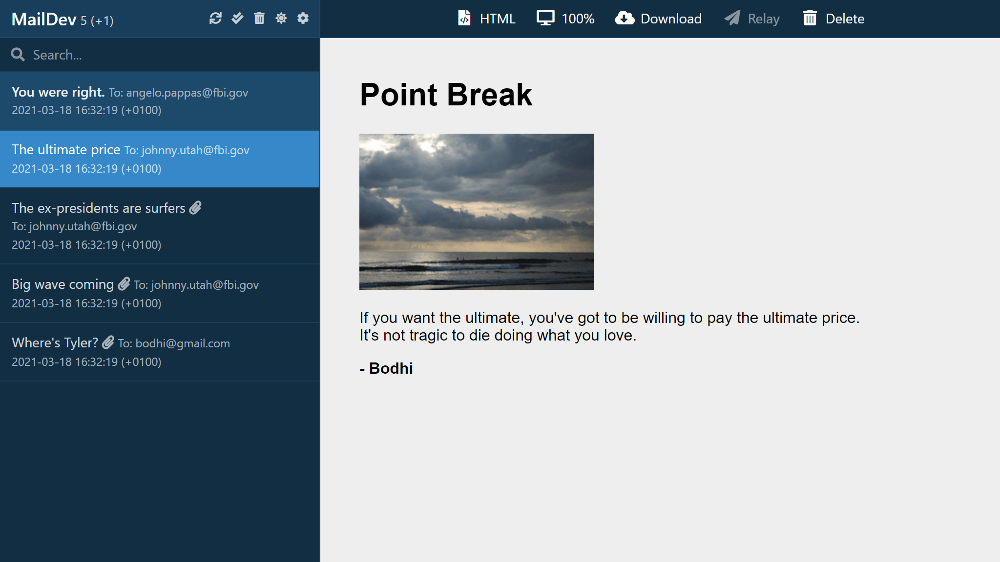

<!-- generated -->

# Maildev

1-Click installation template for Maildev on Easypanel

## Description

Maildev is a simple, self-hosted SMTP server designed for testing and debugging emails in development environments. It captures all outgoing emails and provides a web-based UI to view, inspect, and test them. Maildev supports real-time email updates, allowing developers to see emails as they are sent. It also includes an API for programmatic access to emails and supports multiple inboxes for testing different email scenarios. Maildev is lightweight, easy to set up, and works seamlessly in local development and CI/CD pipelines.

## Benefits

- Email Testing Without Spam: Maildev captures all outgoing emails, preventing them from being sent to real recipients, making it ideal for development and testing environments.
- Web-Based Email Viewer: The Maildev web UI provides a simple interface for viewing and debugging emails, including support for HTML, plain text, and attachments.
- API for Automated Testing: Maildev includes an API that allows developers to programmatically retrieve and manage emails, enabling automated email testing in CI/CD pipelines.

## Features

- Real-Time Email Monitoring: Maildev updates emails in real-time, allowing developers to see messages instantly as they are sent from their applications.
- Multiple Inbox Support: Maildev supports multiple email inboxes, making it useful for testing scenarios that require sending and receiving emails across different addresses.
- SMTP Server for Local Development: Maildev provides an SMTP server that can be configured in local applications to capture outgoing emails without external email services.
- HTML and Plain Text Email Rendering: Emails sent to Maildev can be viewed in both HTML and plain text formats, ensuring correct rendering across different email clients.
- Docker and Kubernetes Ready: Maildev can be easily deployed using Docker or Kubernetes, making it a convenient choice for modern development workflows.

## Links

- [Documentation](https://github.com/maildev/maildev)
- [Github](https://github.com/maildev/maildev)
- [Template Source](https://github.com/easypanel-io/templates/tree/main/templates/maildev)

## Options

Name | Description | Required | Default Value
-|-|-|-
App Service Name | - | yes | maildev
App Service Image | - | yes | maildev/maildev

## Screenshots

## Change Log

- 2025-02-03 – First Release

## Contributors

- [Ahson Shaikh](https://github.com/Ahson-Shaikh)
