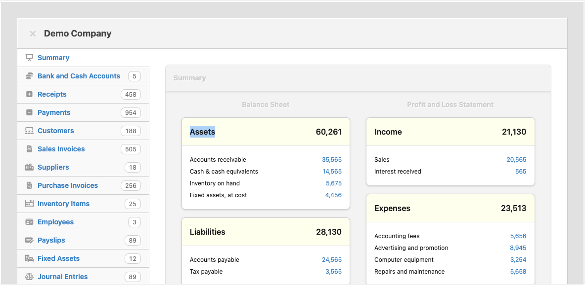

<!-- generated -->

# Manager.io

1-Click installation template for Manager.io on Easypanel

## Description

Manager.io is a versatile accounting software designed for small businesses. It allows you to manage your finances, track expenses, issue invoices, and generate comprehensive financial reports. The software supports multi-currency transactions, inventory tracking, payroll management, and tax calculations. With Manager.io, you can handle all your business accounting needs through an intuitive and user-friendly interface. It&#39;s available for desktop, server, and cloud deployment, offering flexibility and scalability for businesses of all sizes.

## Benefits

- Comprehensive Financial Management: Manager.io provides a robust platform for managing all aspects of your business finances, from tracking expenses to generating detailed financial reports.
- Multi-Platform Availability: Manager.io is available for desktop, server, and cloud deployments, offering flexibility to work in various environments.
- Intuitive User Interface: The software is designed with a user-friendly interface that simplifies accounting tasks for business owners and accountants alike.

## Features

- Multi-Currency Support: Manager.io supports multi-currency transactions, making it ideal for businesses dealing with international clients or suppliers.
- Inventory Management: The software includes inventory tracking features, enabling you to manage stock levels, costs, and reordering.
- Payroll Management: With built-in payroll functionality, Manager.io helps you calculate wages, taxes, and generate pay slips.
- Tax Reporting: Manager.io simplifies tax calculations and reporting, ensuring compliance with local tax regulations.
- Data Backup and Restore: Manager.io allows you to back up your data securely and restore it easily in case of data loss.

## Links

- [Official Website](https://www.manager.io/)
- [Template Source](https://github.com/easypanel-io/templates/tree/main/templates/managerio)

## Options

Name | Description | Required | Default Value
-|-|-|-
App Service Name | - | yes | managerio
App Service Image | - | yes | cronet/manager.io:latest

## Screenshots

## Change Log

- 2025-01-10 – first release

## Contributors

- [Ahson Shaikh](https://github.com/Ahson-Shaikh)
