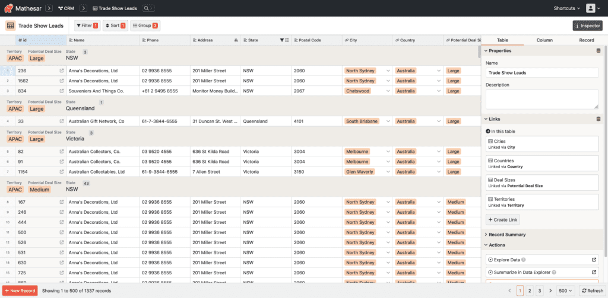

<!-- generated -->

# Mathesar

1-Click installation template for Mathesar on Easypanel

## Description

Mathesar is an open-source database GUI that makes PostgreSQL accessible to non-technical users. It provides an intuitive interface for working with databases without requiring SQL knowledge. Users can visually create and edit tables, modify schemas, browse and manipulate data, and collaborate with team members. Built on PostgreSQL, it leverages the power and reliability of this proven database while adding user-friendly features like spreadsheet-like data editing, relationship visualization, and automated schema management. Mathesar is perfect for teams that need to work with data collaboratively but don&#39;t have extensive database expertise. As a self-hosted solution, it gives organizations complete control over their data and infrastructure. Whether you&#39;re managing content, organizing research data, or building internal tools, Mathesar makes database operations approachable while maintaining the full capabilities of PostgreSQL.

## Benefits

- Empower non-technical teams: Collaborate on real PostgreSQL databases with an intuitive UI for tables, data entry, and schema changes without writing SQL.
- Own your data: Self-hosted deployment ensures full control and compliance; no vendor lock-in.
- Built on PostgreSQL: Leverages proven Postgres features (constraints, types, relationships) while keeping your database accessible from any other tool.

## Features

- Table and schema editing: Create and edit tables, columns, data types, constraints, and relationships visually.
- Data browsing and filtering: Browse, search, sort, and filter data with a familiar spreadsheet-like experience.
- File uploads and attachments: Upload CSV/TSV and manage attachments; optionally configure S3-compatible storage.
- Access control and SSO: Configure users and roles; supports OIDC-based SSO for centralized auth.
- Production-ready proxy: Ships with a Caddy-based reverse proxy for static files and HTTPS.

## Links

- [Website](https://www.mathesar.org)
- [Documentation](https://docs.mathesar.org)
- [Github](https://github.com/mathesar-foundation/mathesar)
- [Template Source](https://github.com/easypanel-io/templates/tree/main/templates/mathesar)

## Options

Name | Description | Required | Default Value
-|-|-|-
Service Name | - | yes | mathesar
App Service Image | - | yes | mathesar/mathesar:0.6.0
Database Image Service | - | yes | pgautoupgrade/pgautoupgrade:18.2-trixie

## Screenshots

## Change Log

- 2025-10-20 – Initial Release (v0.6.0)

## Contributors

- [Ahson Shaikh](https://github.com/Ahson-Shaikh)
