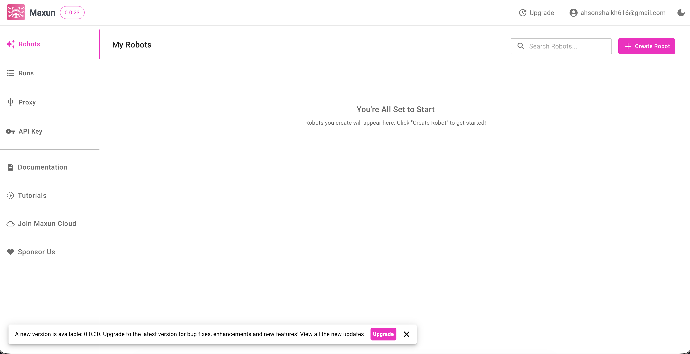

<!-- generated -->

# Maxun

1-Click installation template for Maxun on Easypanel

## Description

Maxun is a self-hosted data automation platform that combines a modern frontend with a backend capable of browser automation (Playwright), file storage via MinIO, and PostgreSQL persistence. It lets you run data collection and integration workflows with headless Chromium, store assets in S3-compatible storage, and manage everything from a web interface. Ideal for teams who need a self-hosted automation stack with database, object storage, and browser automation included.

## Benefits

- Full Stack Included: Ships with backend, frontend, PostgreSQL, and MinIO for a complete automation stack.
- Headless Browser Ready: Playwright enabled for browser automation with sensible defaults for Docker.
- Object Storage Built-In: MinIO provides S3-compatible storage for assets and automation outputs.
- Self-Hosted Control: Keep data, storage, and automation private on your own infrastructure.

## Features

- PostgreSQL Persistence: Production-grade database for Maxun data and automation results.
- MinIO S3 Storage: Store files, exports, and automation artifacts in S3-compatible storage.
- Playwright Support: Headless Chromium with required flags for running inside containers.
- Web UI: Frontend served separately with configurable public URL and backend URL.

## Links

- [GitHub](https://github.com/getmaxun)
- [Website](https://www.maxun.dev/?ref=ghread)
- [Documentation](https://docs.maxun.dev/?ref=ghread)
- [Template Source](https://github.com/easypanel-io/templates/tree/main/templates/maxun)

## Options

Name | Description | Required | Default Value
-|-|-|-
App Service Name | - | yes | maxun
Backend Image | - | yes | getmaxun/maxun-backend:v0.0.30
Frontend Image | - | yes | getmaxun/maxun-frontend:v0.0.30
Minio Image | - | yes | minio/minio:RELEASE.2025-07-23T15-54-02Z

## Screenshots

## Change Log

- 2025-12-15 – Template Release

## Contributors

- [Ahson Shaikh](https://github.com/Ahson-Shaikh)
