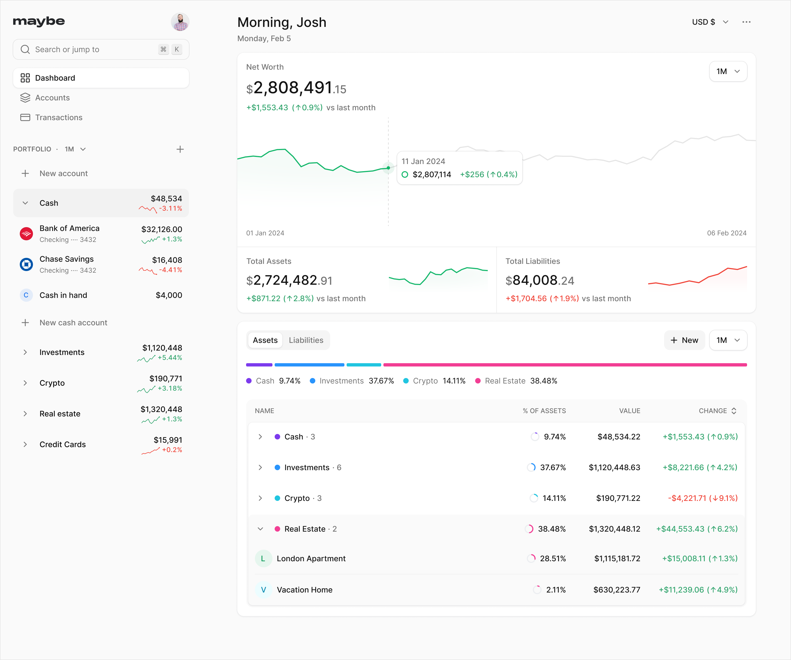

<!-- generated -->

# Maybe Finance

1-Click installation template for Maybe Finance on Easypanel

## Description

Maybe Finance is a modern, self-hosted finance management tool designed for tracking personal or business finances efficiently. It provides a clean and user-friendly interface, supports integrations for extended functionality, and offers detailed analytics for insights into your financial data. With Maybe Finance, you can take control of your finances, track expenses, and make informed decisions.

## Benefits

- Financial Control: Maybe Finance helps you track expenses, budgets, and savings to keep your finances in check.
- Self-Hosted Privacy: Host Maybe Finance on your infrastructure to ensure full control and privacy over your financial data.
- Custom Insights: Generate detailed analytics to gain deeper insights into your financial trends and behavior.

## Features

- Expense Tracking: Keep a record of your expenses and categorize them for better budgeting.
- API Integrations: Connect Maybe Finance with other tools using its flexible API for seamless data flow.
- Custom Reports: Create detailed financial reports with insights into income, expenses, and savings.
- Secure and Reliable: Enjoy a secure, self-hosted platform for managing sensitive financial information.

## Links

- [GitHub](https://github.com/maybe-finance/maybe)
- [Template Source](https://github.com/easypanel-io/templates/tree/main/templates/maybe-finance)

## Options

Name | Description | Required | Default Value
-|-|-|-
App Service Name | - | yes | maybe
App Service Image | - | yes | ghcr.io/maybe-finance/maybe:sha-77b5469832758d1cbee1a940f3012a1ae1c74cd3

## Screenshots

## Change Log

- 2024-11-25 – Template Release
- 2025-06-05 – Update to 0.5.0
- 2025-07-22 – Update to sha-347c0a790693031fdd3b32792b5b6792693d1805
- 2025-12-29 – Version bumped to sha-77b5469832758d1cbee1a940f3012a1ae1c74cd3

## Contributors

- [Ahson Shaikh](https://github.com/Ahson-Shaikh)
