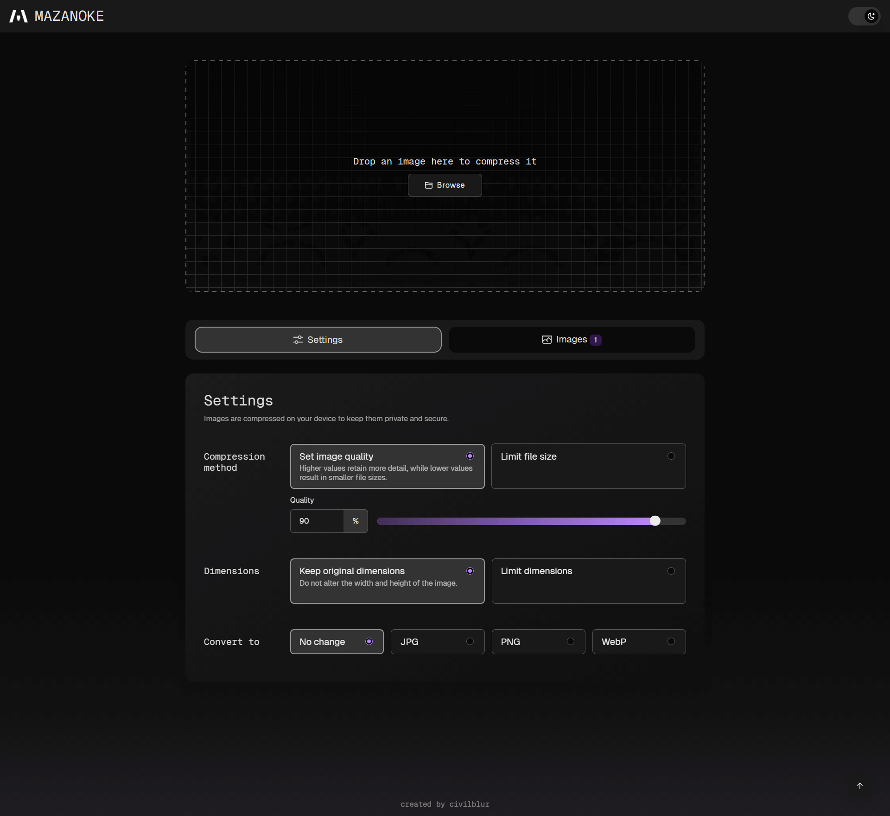

<!-- generated -->

# Mazanoke

1-Click installation template for Mazanoke on Easypanel

## Description

Mazanoke is a self-hosted local image optimizer that runs in your browser. It works offline and keeps your images private without ever leaving your device. Created for everyday people and designed to be shared with family and friends, it serves as an alternative to questionable &quot;free&quot; online tools.

## Benefits

- Privacy-Focused Image Processing: All image processing happens locally in your browser, ensuring your images never leave your device and remain completely private.
- Offline Functionality: Works completely offline once loaded, making it perfect for use anywhere without requiring an internet connection.
- Alternative to Online Tools: Provides a trustworthy alternative to questionable "free" online image optimization tools that may compromise your privacy.

## Features

- Image Quality Optimization: Adjust image quality, set target file size, and configure max width/height to optimize your images for web use or storage efficiency.
- Multiple Format Support: Convert between and to JPG, PNG, WebP, ICO formats, and convert from HEIC, AVIF, TIFF, GIF, SVG formats for maximum compatibility.
- Clipboard Integration: Paste images directly from your clipboard for instant optimization without needing to upload files from your device.
- EXIF Data Removal: Automatically removes EXIF data including location, date, and other metadata to protect your privacy and reduce file sizes.
- Progressive Web App: Installable web app that can be used offline, with shortcuts added to your device for convenient access anytime.
- No Tracking: Completely free of tracking, analytics, or data collection, ensuring your privacy is fully protected during image processing.

## Links

- [Documentation](https://github.com/civilblur/mazanoke)
- [Github](https://github.com/civilblur/mazanoke)
- [Template Source](https://github.com/easypanel-io/templates/tree/main/templates/mazanoke)

## Options

Name | Description | Required | Default Value
-|-|-|-
App Service Name | - | yes | mazanoke
App Service Image | - | yes | ghcr.io/civilblur/mazanoke:v1.1.5
Admin Username | - | yes | admin
Admin Password | - | yes | admin

## Screenshots

## Change Log

- 2025-09-12 – Template Release (v1.1.5)

## Contributors

- [Ahson Shaikh](https://github.com/Ahson-Shaikh)
