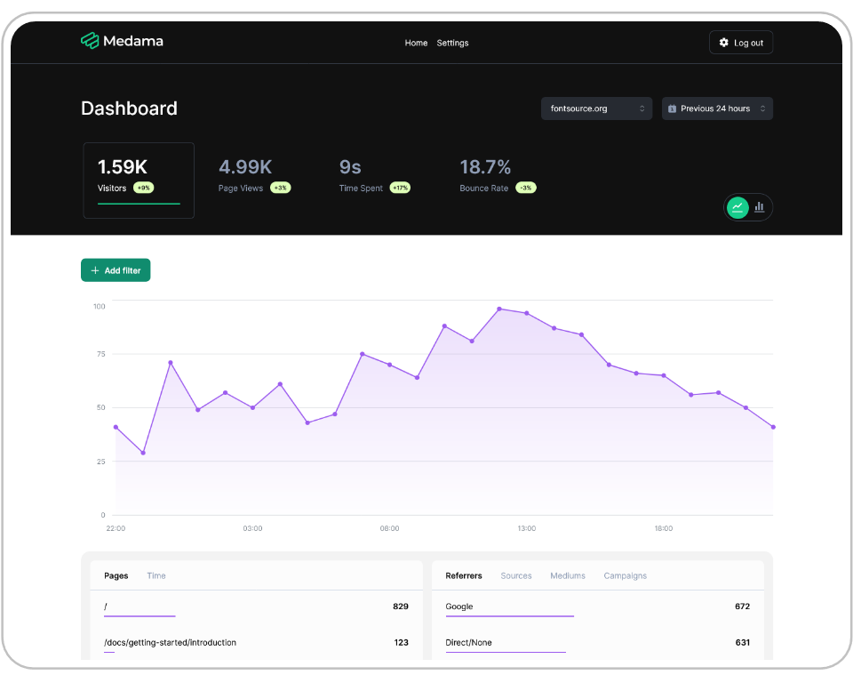

<!-- generated -->

# Medama

1-Click installation template for Medama on Easypanel

## Description

Medama Analytics is an open-source project dedicated to providing self-hostable, cookie-free website analytics. With a lightweight tracker of less than 1KB, it aims to offer useful analytics while prioritising user privacy.

## Instructions

Login credentials, username; admin and password; CHANGE_ME_ON_FIRST_LOGIN

## Benefits

- Privacy Focused: Prioritizes user privacy by providing cookie-free analytics.
- Lightweight: Less than 1KB tracker ensures minimal impact on website performance.
- Open Source: Fully open-source project allowing for community contributions and transparency.
- Self-Hostable: Easily deployable on your own infrastructure for complete control.
- Useful Analytics: Provides essential analytics to help you understand your website traffic.

## Features

- Cookie-Free Tracking: Tracks website analytics without using cookies, ensuring user privacy.
- Lightweight Tracker: Tracker script is less than 1KB, minimizing load on your website.
- Open Source: Source code is available for anyone to inspect, modify, and contribute to.
- Self-Hosting: Can be deployed on your own servers, giving you full control over your data.
- Essential Analytics: Provides key metrics to help you understand and optimize your website traffic.

## Links

- [Github](https://github.com/medama-io/medama)
- [Documentation](https://oss.medama.io/introduction)
- [Template Source](https://github.com/easypanel-io/templates/tree/main/templates/medama)

## Options

Name | Description | Required | Default Value
-|-|-|-
App Service Name | - | yes | medama
App Service Image | - | yes | ghcr.io/medama-io/medama:v0.6.2

## Screenshots

## Change Log

- 2025-04-08 – First Release
- 2026-05-04 – Version bumped to v0.6.2

## Contributors

- [Ahson Shaikh](https://github.com/Ahson-Shaikh)
