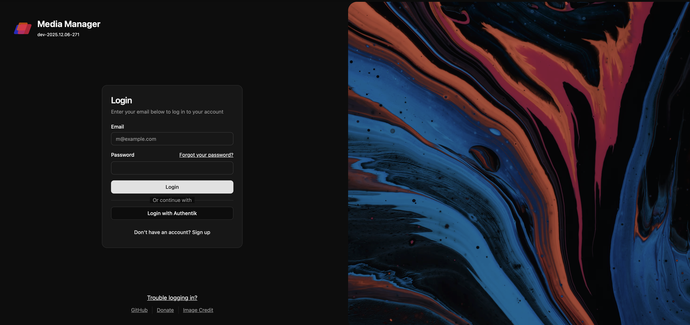

<!-- generated -->

# MediaManager

1-Click installation template for MediaManager on Easypanel

## Description

MediaManager is a self-hosted media management application designed to help you organize, catalog, and manage your media collection. The application provides a clean web interface for browsing and managing your media files including movies, TV shows, music, and other digital content. With support for custom metadata, tagging, and categorization, MediaManager makes it easy to keep your media library organized and accessible. The application features automatic media scanning, metadata extraction, thumbnail generation, and search capabilities to quickly find content in large collections. Built with a PostgreSQL backend for reliable data storage, MediaManager can handle extensive media libraries with thousands of items. The flexible configuration system allows you to customize media directories, scanning behavior, and display preferences to match your needs. Perfect for home media enthusiasts who want to organize their digital collections, content creators managing large media archives, small organizations needing a simple media asset management solution, or anyone looking for a lightweight self-hosted alternative to complex media management systems.

## Instructions

After deploy, edit the mounted config.toml on the MediaManager app service.
Set [auth].admin_emails and [misc] library paths to match your setup.
Configure SMTP, OpenID, torrents, or indexers only if you use those features.
See https://maxdorninger.github.io/MediaManager/configuration-overview.html for details.

## Benefits

- Organized Media Library: Keep your entire media collection organized with custom metadata, tags, and categories for easy browsing and management.
- Self-Hosted Privacy: Host your media catalog on your own infrastructure with complete control over your data and no reliance on third-party services.
- Fast Search: Quickly find any media item in your collection with powerful search and filtering capabilities across all metadata.
- Lightweight Solution: Simple and efficient media management without the complexity of full-featured media server applications.

## Features

- Media Scanning: Automatically scan configured directories to discover and catalog new media files as they are added to your collection.
- Metadata Management: Add and edit metadata for your media items including titles, descriptions, tags, and custom fields.
- Thumbnail Generation: Automatic thumbnail generation for visual browsing of your media collection in the web interface.
- Category Organization: Organize media into categories and collections for logical grouping and easier navigation.
- Web Interface: Clean, responsive web interface for browsing and managing your media library from any device.
- PostgreSQL Backend: Reliable PostgreSQL database backend for storing metadata and supporting large media collections.
- Flexible Configuration: Customizable settings for media directories, scanning behavior, and display preferences.
- Search & Filter: Advanced search and filtering options to quickly locate specific media items across your entire library.

## Links

- [Website](https://maxdorninger.github.io/MediaManager/)
- [Documentation](https://maxdorninger.github.io/MediaManager/introduction.html)
- [GitHub](https://github.com/maxdorninger/mediamanager)
- [Template Source](https://github.com/easypanel-io/templates/tree/main/templates/mediamanager)

## Options

Name | Description | Required | Default Value
-|-|-|-
App Service Name | - | yes | mediamanager
App Service Image | - | yes | ghcr.io/maxdorninger/mediamanager:1.12.3

## Screenshots

## Change Log

- 2025-12-10 – Template Release

## Contributors

- [Ahson Shaikh](https://github.com/Ahson-Shaikh)
