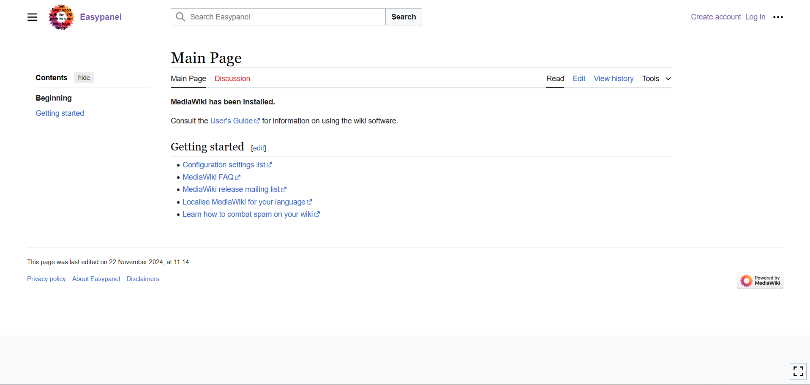

<!-- generated -->

# MediaWiki

1-Click installation template for MediaWiki on Easypanel

## Description

MediaWiki is a powerful, open-source wiki platform that powers some of the largest collaborative projects, including Wikipedia. It offers a flexible and extensible framework for creating and managing content, supporting features like user management, version control, and powerful extensions. MediaWiki provides multilingual support, ensuring global accessibility, and includes built-in tools for content organization, search, and collaboration. It is an ideal solution for knowledge bases, documentation sites, and community-driven content platforms. With a vibrant ecosystem of plugins and themes, MediaWiki can be customized to suit diverse use cases.

## Instructions

During the installation, configure the database as prompted, and once completed, a file named &quot;LocalSettings.php&quot; will be downloaded. Open EasyPanel, navigate to the Storage section for MediaWiki, and create a file mount. Paste the content of the LocalSettings.php file into the mount and set its mount path to /var/www/html/LocalSettings.php. Finally, redeploy the MediaWiki app in EasyPanel to apply the configuration.

## Benefits

- Robust Content Management: MediaWiki provides a comprehensive set of tools for organizing, editing, and managing collaborative content, making it suitable for knowledge bases and wikis.
- Customizable and Extensible: Leverage a wide array of extensions and skins to tailor MediaWiki to your specific needs, whether for a public-facing site or internal documentation.
- Multilingual Support: Easily create multilingual content and manage translations with built-in language support, ensuring accessibility for a global audience.
- Scalable and Flexible: MediaWiki is built to handle projects of any size, from small teams to massive, high-traffic sites like Wikipedia.
- Open Source: MediaWiki is open-source, offering complete control and the freedom to modify and adapt it to your organization's needs.

## Features

- Revision History and Versioning: Track changes with a complete revision history, allowing users to compare, restore, and review edits.
- User Management and Permissions: Manage users and define granular permissions to control access and editing rights on your wiki.
- Full-Text Search: MediaWiki includes a powerful search feature to help users quickly find the information they need.
- Structured Data with Templates: Use templates to standardize and organize content, making it easier to maintain and update.
- Active Community: Join an active community of contributors and developers, offering support and fostering innovation within the MediaWiki ecosystem.

## Links

- [Website](https://www.mediawiki.org)
- [Documentation](https://www.mediawiki.org/wiki/Manual:Contents)
- [Github](https://github.com/wikimedia/mediawiki)
- [Template Source](https://github.com/easypanel-io/templates/tree/main/templates/mediawiki)

## Options

Name | Description | Required | Default Value
-|-|-|-
App Service Name | - | yes | mediawiki
App Service Image | - | yes | mediawiki:1.42.3

## Screenshots

## Change Log

- 2024-11-22 – First Release

## Contributors

- [Ahson Shaikh](https://github.com/Ahson-Shaikh)
