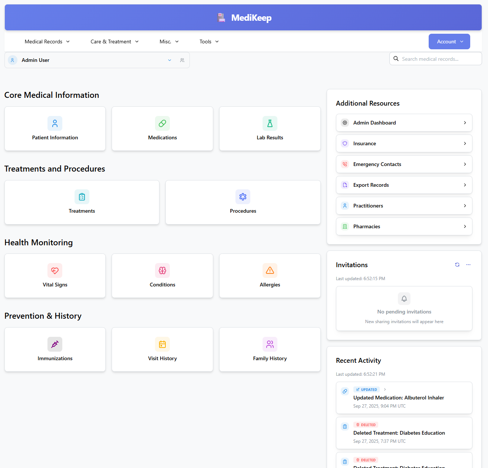
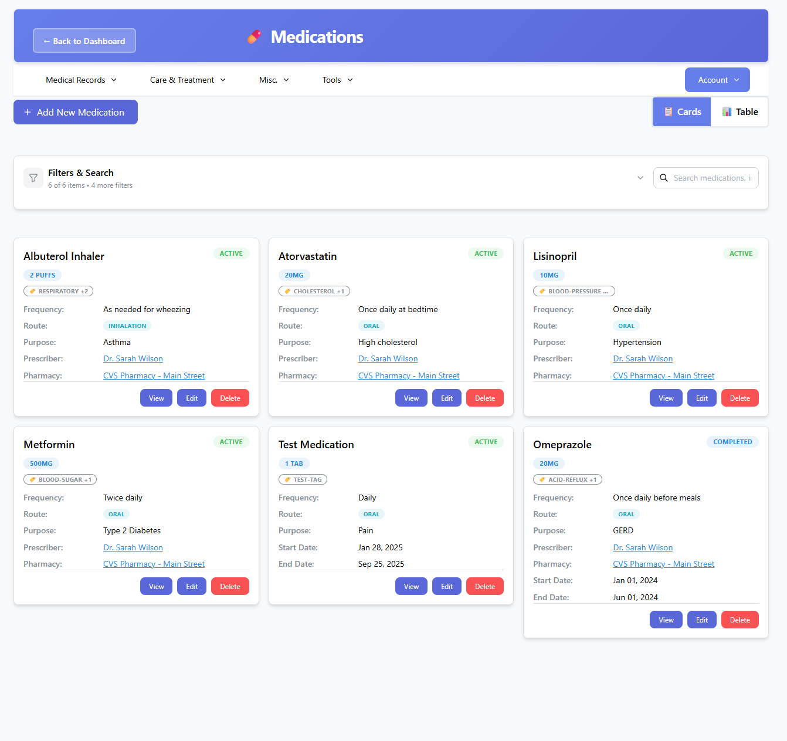
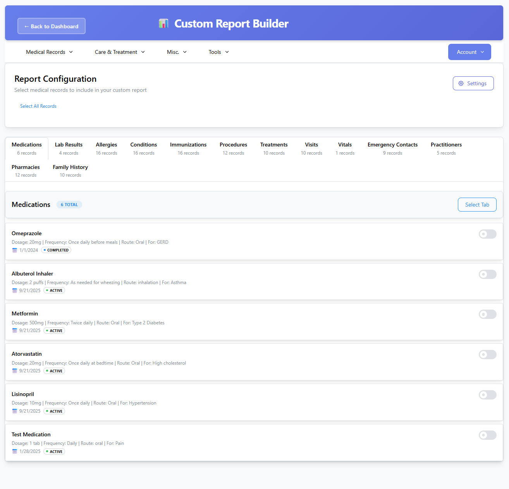

<!-- generated -->

# MediKeep

1-Click installation template for MediKeep on Easypanel

## Description

MediKeep is a lightweight, self-hosted application for managing your personal medical information. Keep your health records organized and accessible while maintaining complete control over your data privacy. Built with React frontend and FastAPI backend, MediKeep provides a secure platform for tracking medications, generating health reports, and managing your medical records with ease.

## Benefits

- Complete Data Privacy: Keep your medical records secure and private with self-hosted deployment. You maintain complete control over your sensitive health information.
- Medication Tracking: Track and manage all your medications, dosages, and schedules in one convenient location, helping you stay on top of your health regimen.
- Health Report Generation: Generate custom health reports and export your medical data for sharing with healthcare providers, making medical visits more efficient.

## Features

- React Frontend: Modern, responsive user interface built with React for an intuitive user experience across desktop and mobile devices.
- FastAPI Backend: High-performance backend built with FastAPI, ensuring fast and reliable access to your medical records.
- SSO Support: Optional Single Sign-On integration with Google, GitHub, or OIDC providers for seamless authentication.
- Backup and Restore: Built-in backup and restore functionality with CLI support for automated scheduled backups, ensuring your data is always protected.

## Links

- [Website](https://medikeeps.com)
- [GitHub](https://github.com/afairgiant/MediKeep)
- [Documentation](https://github.com/afairgiant/MediKeep/tree/main/docs)
- [Template Source](https://github.com/easypanel-io/templates/tree/main/templates/medikeep)

## Options

Name | Description | Required | Default Value
-|-|-|-
App Service Name | - | yes | medikeep
App Service Image | - | yes | ghcr.io/afairgiant/medikeep:v0.64.0
Admin Default Password (Optional) | Default password for the admin user on fresh installations. Auto-generated if not provided. | no | 
Secret Key (Auto-generated if empty) | JWT secret key for authentication. Auto-generated if not provided. | no | 
Timezone | - | yes | America/New_York
Log Level | - | no | INFO
Enable SSO | Enable Single Sign-On authentication (Google, GitHub, or OIDC) | no | false
SSO Provider Type | SSO provider type (e.g., oidc, google, github). Required if SSO is enabled. | no | 
SSO Client ID | SSO client ID. Required if SSO is enabled. | no | 
SSO Client Secret | SSO client secret. Required if SSO is enabled. | no | 
SSO Issuer URL | SSO issuer URL (for OIDC providers). Required for OIDC SSO. | no | 
SSO Redirect URI | SSO redirect URI. Usually https://your-domain/api/v1/auth/sso/callback | no | 
SSO Allowed Domains | Comma-separated list of allowed domains for SSO (e.g., example.com,example.org) | no | 

## Screenshots

## Change Log

- 2025-02-09 – Initial template release
- 2026-05-04 – Version bumped to v0.64.0

## Contributors

- [Ahson Shaikh](https://github.com/Ahson-Shaikh)
