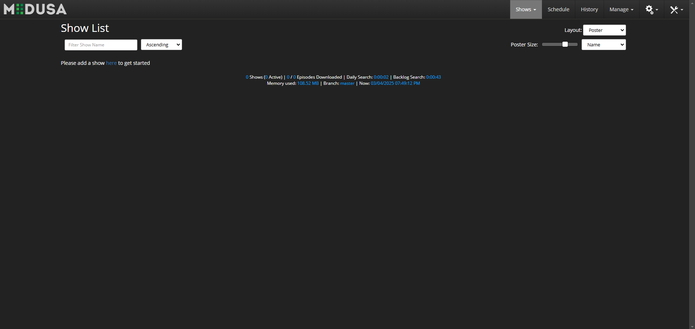

<!-- generated -->

# Medusa

1-Click installation template for Medusa on Easypanel

## Description

Medusa is an automatic Video Library Manager for TV Shows. It continuously monitors multiple sources for new episodes of your favorite TV shows and automatically downloads, processes, and organizes them. Medusa fetches metadata, renames files, and ensures your media library is structured and up-to-date. With a powerful and customizable automation system, it supports multiple download clients, subtitle providers, and metadata sources. Medusa integrates with popular media servers, ensuring seamless media management.

## Benefits

- Automated TV Show Management: Medusa continuously scans multiple sources for new TV show episodes and downloads them automatically. It helps you keep your media library updated without manual intervention.
- Smart File Organization: Medusa renames and organizes downloaded episodes into a structured library with metadata, subtitles, and proper file-naming conventions. This makes it easy to manage and access your media.
- Integration with Media Servers: Medusa integrates with media servers like Plex, Emby, and Kodi, ensuring that your newly downloaded content is instantly available in your media library.

## Features

- Multi-Source Episode Tracking: Medusa tracks episodes from various torrent and Usenet sources, ensuring you never miss a release.
- Automatic Subtitle Downloading: Medusa supports automatic subtitle fetching from multiple providers, allowing you to enjoy content in different languages.
- Custom Download Client Support: Medusa integrates with multiple torrent and Usenet download clients, including Transmission, qBittorrent, Deluge, SABnzbd, and NZBGet.
- Post-Processing Automation: Medusa can automatically extract, rename, and move downloaded files to the correct directories based on customizable rules.
- Metadata Fetching: Medusa fetches metadata such as episode information, posters, and descriptions from TVDB, TMDB, and other sources.

## Links

- [Documentation](https://github.com/pymedusa/Medusa/wiki)
- [Github](https://github.com/pymedusa/Medusa)
- [Template Source](https://github.com/easypanel-io/templates/tree/main/templates/medusa)

## Options

Name | Description | Required | Default Value
-|-|-|-
App Service Name | - | yes | medusa
App Service Image | - | yes | lscr.io/linuxserver/medusa:1.0.25

## Screenshots

## Change Log

- 2025-03-04 – First Release
- 2025-12-29 – Version bumped to 1.0.25

## Contributors

- [Ahson Shaikh](https://github.com/Ahson-Shaikh)
