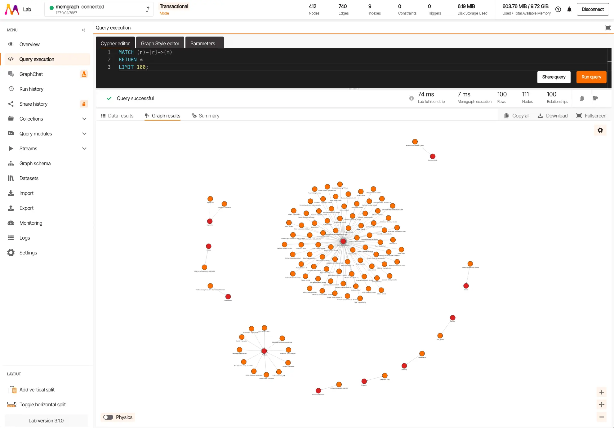

<!-- generated -->

# Memgraph

1-Click installation template for Memgraph on Easypanel

## Description

Memgraph is a high-performance, in-memory graph database designed for real-time analytics and machine learning applications. It provides fast graph traversal, pattern matching, and complex graph algorithms with support for Cypher query language. Memgraph MAGE (Memgraph Advanced Graph Extensions) includes pre-built graph algorithms and machine learning modules. The platform comes with Memgraph Lab, a visual interface for database management, query development, and graph visualization.

## Benefits

- High-Performance Graph Database: In-memory graph database optimized for real-time analytics and complex graph operations with sub-millisecond query response times.
- Advanced Graph Algorithms: Pre-built graph algorithms and machine learning modules through MAGE extensions for complex graph analytics and data science workflows.
- Visual Graph Management: Memgraph Lab provides an intuitive visual interface for database management, query development, and interactive graph visualization.
- Cypher Query Language: Industry-standard Cypher query language support for expressive and efficient graph data manipulation and analysis.

## Features

- Real-Time Analytics: Optimized for real-time graph analytics with fast data ingestion and query processing capabilities for streaming data applications.
- Graph Visualization: Interactive graph visualization tools in Memgraph Lab for exploring complex relationships and patterns in your data.
- Machine Learning Integration: Built-in machine learning algorithms and extensions for graph-based ML workflows and predictive analytics.
- Scalable Architecture: Horizontal scaling capabilities and distributed graph processing for handling large-scale graph datasets and high-throughput applications.
- Developer-Friendly: Comprehensive APIs, drivers for multiple programming languages, and extensive documentation for easy integration and development.
- Enterprise Features: Enterprise-grade security, monitoring, and management features for production deployments and mission-critical applications.

## Links

- [GitHub](https://github.com/memgraph/memgraph)
- [Docker Hub](https://hub.docker.com/r/memgraph/memgraph)
- [Template Source](https://github.com/easypanel-io/templates/tree/main/templates/memgraph)

## Options

Name | Description | Required | Default Value
-|-|-|-
App Service Name | - | yes | memgraph
App Service Image | Memgraph MAGE Docker image | yes | memgraph/memgraph-mage:3.7.2
Lab Image | Memgraph Lab Docker image | yes | memgraph/lab:3.5.0

## Screenshots

## Change Log

- 2025-09-10 – Initial Template Release
- 2025-12-29 – Version bumped to 3.7.2

## Contributors

- [Ahson Shaikh](https://github.com/Ahson-Shaikh)
