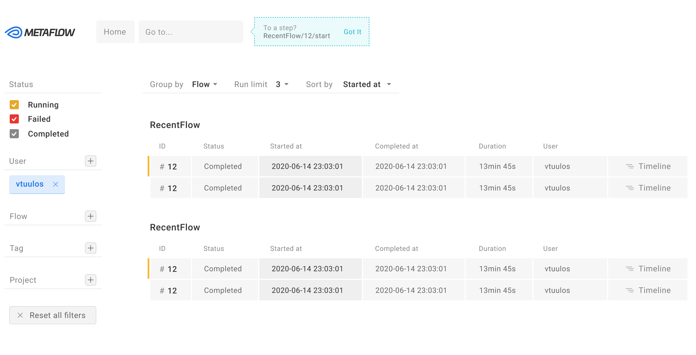

<!-- generated -->

# Metaflow

1-Click installation template for Metaflow on Easypanel

## Description

Metaflow is an open-source framework for building and managing real-life ML, AI, and data science projects. Originally developed at Netflix and now supported by Outerbounds, Metaflow streamlines the entire development lifecycle—from rapid prototyping in notebooks to reliable production deployments. It unifies code, data, and compute at every stage, enabling teams to iterate quickly and deliver robust AI/ML systems. Used by Amazon, Doordash, Goldman Sachs, and many others.

## Instructions

Deploy Metaflow metadata service to track your flows. Configure your Metaflow client with METAFLOW_SERVICE_URL pointing to your deployment URL and METAFLOW_DEFAULT_METADATA=service. Run flows with `python myflow.py run` and metadata will be stored. Allow ~30 seconds for the metadata service to start.

## Benefits

- Human-Centric ML Framework: Metaflow is designed to boost productivity for research and engineering teams, from classical statistics to state-of-the-art deep learning.
- Prototype to Production: Seamlessly move from rapid prototyping in notebooks to reliable, maintainable production deployments with built-in versioning and tracking.
- Battle-Tested at Scale: Powers thousands of AI/ML projects at Netflix and beyond, processing hundreds of millions of compute jobs and petabytes of data.
- Self-Hosted & Open Source: Full control over your metadata and infrastructure. Apache 2.0 licensed.

## Features

- Experiment Tracking: Built-in support for experiment tracking, versioning, and visualization of flows, runs, steps, and artifacts.
- Remote Execution: Scale horizontally and vertically in your cloud, utilizing both CPUs and GPUs with fast data access.
- Production Orchestration: One-click deploy to production orchestrators with reactive orchestration and event-triggering support.
- Dependency Management: Easily manage dependencies and deploy with reproducible environments.

## Links

- [Website](https://metaflow.org/)
- [Documentation](https://docs.metaflow.org/)
- [GitHub](https://github.com/Netflix/metaflow)
- [Metaflow Service](https://github.com/Netflix/metaflow-service)
- [Template Source](https://github.com/easypanel-io/templates/tree/main/templates/metaflow)

## Options

Name | Description | Required | Default Value
-|-|-|-
App Service Name | - | yes | metaflow
Metadata Service Image | Docker image for the Metaflow metadata service | yes | netflixoss/metaflow_metadata_service:v2.5.0

## Screenshots

## Change Log

- 2026-02-09 – Initial release

## Contributors

- [Ahson Shaikh](https://github.com/Ahson-Shaikh)
