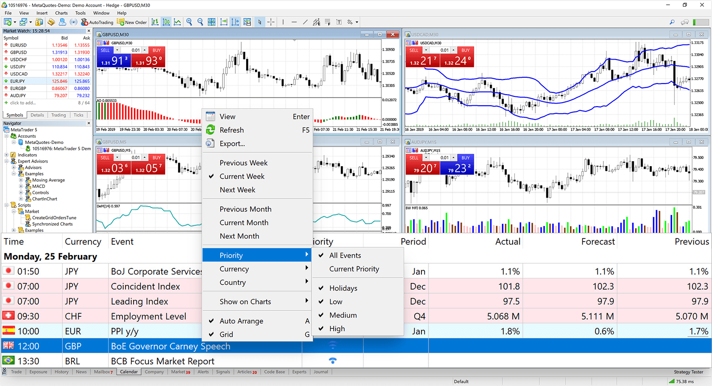

<!-- generated -->

# MetaTrader5

1-Click installation template for MetaTrader5 on Easypanel

## Description

MetaTrader 5 (MT5) is a powerful, multi-functional trading platform designed for financial institutions, brokers, and individual traders. It supports trading in various financial markets, including Forex, stocks, futures, and CFDs. MT5 offers advanced charting tools, technical indicators, and automated trading capabilities through Expert Advisors (EAs). With a focus on speed, reliability, and flexibility, MT5 enables seamless market analysis, efficient trade execution, and comprehensive risk management. The platform supports multi-asset trading, backtesting, and a robust API for custom integrations.

## Benefits

- Advanced Trading Tools: MT5 provides a comprehensive suite of tools for market analysis, trade execution, and automated trading strategies.
- Multi-Asset Trading: MT5 supports trading across Forex, stocks, futures, and CFDs, catering to diverse financial markets.
- Customizable and Scalable: MT5 offers robust APIs for integrations, as well as support for custom trading bots and indicators.

## Features

- Advanced Charting: MT5 includes multiple chart types, timeframes, and technical indicators for in-depth market analysis.
- Automated Trading: MT5 supports Expert Advisors (EAs) for automated trading strategies and algorithmic trading.
- Multi-Device Access: MT5 provides a seamless trading experience across desktop, mobile, and web platforms.
- Economic Calendar: MT5 includes a built-in economic calendar for tracking market events and planning trades effectively.

## Links

- [Website](https://www.metatrader5.com/en)
- [Documentation](https://www.metatrader5.com/en/terminal/help)
- [Github](https://github.com/gmag11/MetaTrader5-Docker-Image)
- [Docker Guide](https://hub.docker.com/r/gmag11/metatrader5_vnc)
- [Template Source](https://github.com/easypanel-io/templates/tree/main/templates/metatrader5)

## Options

Name | Description | Required | Default Value
-|-|-|-
App Service Name | - | yes | metatrader5
App Service Image | - | yes | gmag11/metatrader5_vnc
User Name | - | yes | admin
Password | - | yes | password

## Screenshots

## Change Log

- 2024-01-08 – First Release

## Contributors

- [Ahson Shaikh](https://github.com/Ahson-Shaikh)
