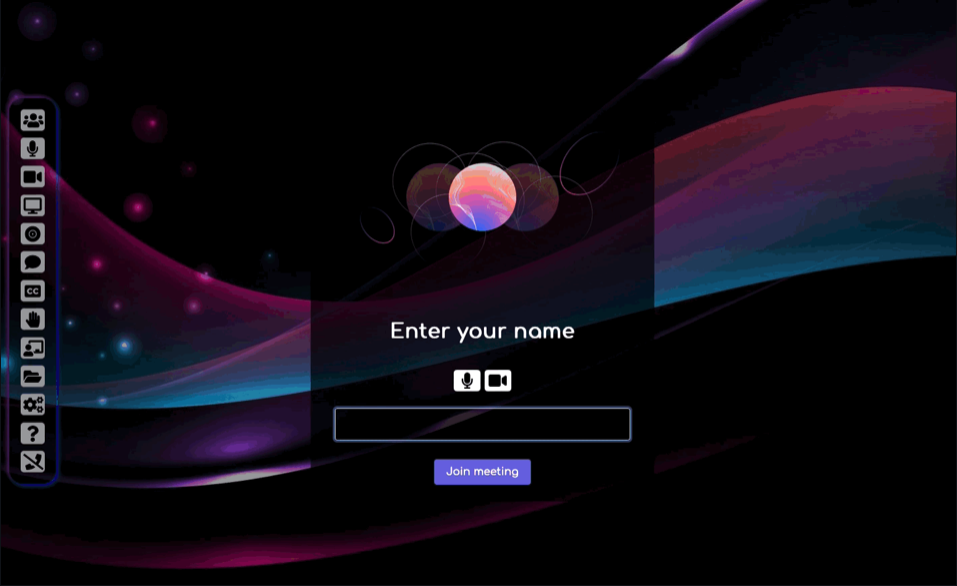

<!-- generated -->

# MiroTalk P2P

1-Click installation template for MiroTalk P2P on Easypanel

## Description

MiroTalk P2P is a powerful WebRTC-based peer-to-peer video conferencing platform that enables secure, real-time communication directly between participants without requiring external servers for media transmission. It offers advanced features like screen sharing, file transfer, chat messaging, and room protection, making it perfect for businesses, educational institutions, and personal use that require privacy-focused video conferencing solutions.

## Benefits

- Privacy-Focused Communication: Peer-to-peer architecture ensures your video calls remain private and secure, with no data passing through external servers.
- Zero Installation Required: Web-based platform that works directly in browsers without requiring participants to download or install any software.
- Advanced Collaboration Tools: Built-in screen sharing, file transfer, interactive whiteboard, and real-time chat enhance meeting productivity.
- Scalable Room Management: Support for multiple participants with configurable room limits and host protection features for controlled access.
- Enterprise-Ready Security: OIDC authentication, JWT tokens, IP whitelisting, and host protection provide enterprise-grade security controls.
- Extensive Integration Options: Built-in support for Slack, Mattermost, ChatGPT, email notifications, and analytics tracking for seamless workflow integration.

## Features

- WebRTC Peer-to-Peer Video: High-quality video conferencing using WebRTC technology for direct participant-to-participant communication without server relay.
- Screen Sharing & Recording: Share your screen, specific applications, or browser tabs with participants, plus recording capabilities for important meetings.
- Interactive Whiteboard: Collaborative whiteboard tool for drawing, annotations, and visual collaboration during meetings.
- File Transfer: Secure peer-to-peer file sharing between participants without uploading to external servers.
- Real-time Chat: Text messaging with emoji support, private messaging, and chat history for enhanced communication.
- Room Protection: Password-protected rooms, host authentication, and user access controls for secure meeting environments.
- STUN/TURN Support: Configurable STUN and TURN servers for reliable connections across different network configurations and firewalls.
- Multi-Platform Support: Cross-platform compatibility across desktop browsers, mobile devices, and tablets for maximum accessibility.
- API Integration: RESTful API for programmatic room creation and management, plus webhook support for external integrations.
- Analytics & Monitoring: Built-in analytics, error tracking with Sentry, and customizable monitoring for usage insights and troubleshooting.

## Links

- [Website](https://p2p.mirotalk.com)
- [Documentation](https://docs.mirotalk.com)
- [GitHub](https://github.com/miroslavpejic85/mirotalk)
- [Template Source](https://github.com/easypanel-io/templates/tree/main/templates/mirotalk)

## Options

Name | Description | Required | Default Value
-|-|-|-
App Service Name | - | yes | mirotalk
App Service Image | - | yes | mirotalk/p2p:latest

## Screenshots

## Change Log

- 2025-07-23 – Initial release

## Contributors

- [Ahson Shaikh](https://github.com/Ahson-Shaikh)
