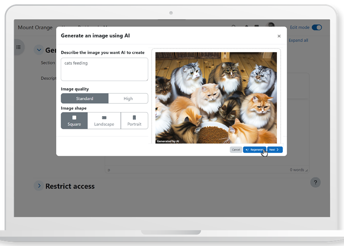

<!-- generated -->

# Moodle

1-Click installation template for Moodle on Easypanel

## Description

Moodle is a robust, scalable, and open-source learning management system (LMS) designed to provide educators and learners with a customizable platform to create and deliver personalized learning experiences. With Moodle, you can manage courses, track progress, and collaborate using a variety of tools like forums, assignments, and quizzes. It supports integrations with numerous third-party tools and plugins to enhance functionality. Moodle focuses on accessibility, ensuring an inclusive experience for all users. It is widely used in academic institutions, businesses, and non-profits globally to deliver quality online education. Moodle is a free, open-source project distributed under the GNU General Public License.

## Instructions

Moodle takes time to install. Default credentails; username=user, password=bitnami

## Benefits

- Personalized Learning Experience: Moodle enables educators to create customized learning environments for their students, enhancing engagement and improving outcomes.
- Scalable and Flexible: Moodle can scale from small classes to large organizations and integrates with various third-party tools and plugins to meet diverse needs.
- Open Source and Free: Moodle is distributed under the GNU General Public License, ensuring that it remains free and open-source, empowering communities worldwide to improve education.

## Features

- Course Management: Moodle provides extensive tools for managing courses, including assignments, quizzes, and tracking student progress.
- Collaboration Tools: Moodle offers forums, chats, and group activities to facilitate collaboration and communication among users.
- Mobile-Friendly: Moodle’s mobile app allows users to access their courses and learning materials on the go, ensuring seamless learning experiences across devices.

## Links

- [Website](https://moodle.org/)
- [Documentation](https://docs.moodle.org/)
- [Github](https://github.com/moodle)
- [Template Source](https://github.com/easypanel-io/templates/tree/main/templates/moodle)

## Options

Name | Description | Required | Default Value
-|-|-|-
App Service Name | - | yes | moodle
App Service Image | - | yes | docker.io/bitnami/moodle:4.5

## Screenshots

## Change Log

- 2025-01-13 – First Release

## Contributors

- [Ahson Shaikh](https://github.com/Ahson-Shaikh)
