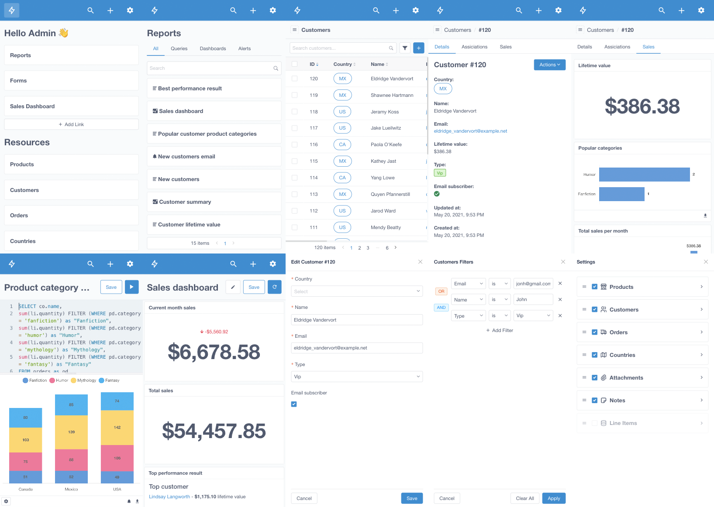

<!-- generated -->

# MotorAdmin

1-Click installation template for MotorAdmin on Easypanel

## Description

MotorAdmin is a modern, open-source database administration tool that provides a user-friendly interface for managing and interacting with your databases. It offers features for data visualization, query building, and database management.

## Benefits

- Database Management: User-friendly interface for managing and interacting with databases.
- Data Visualization: Visualize and analyze your data with intuitive tools.
- Query Building: Build and execute database queries with ease.
- Secure Access: Secure database access with proper authentication.
- Data Persistence: Reliable PostgreSQL database for storing application data.

## Features

- Database Interface: Intuitive web interface for database management.
- Query Builder: Visual tools for building and executing database queries.
- Data Visualization: Tools for visualizing and analyzing database content.
- User Management: Manage user access and permissions.
- Modern Interface: Clean and intuitive web interface for database administration.

## Links

- [Website](https://www.getmotoradmin.com)
- [Github](https://github.com/motor-admin/motor-admin)
- [Documentation](https://docs.getmotoradmin.com/guide/)
- [Template Source](https://github.com/easypanel-io/templates/tree/main/templates/motoradmin)

## Options

Name | Description | Required | Default Value
-|-|-|-
App Service Name | - | yes | motoradmin
App Service Image | - | yes | motoradmin/motoradmin:0.4.21

## Screenshots

## Change Log

- 2025-04-16 – First Release

## Contributors

- [Ahson Shaikh](https://github.com/Ahson-Shaikh)
