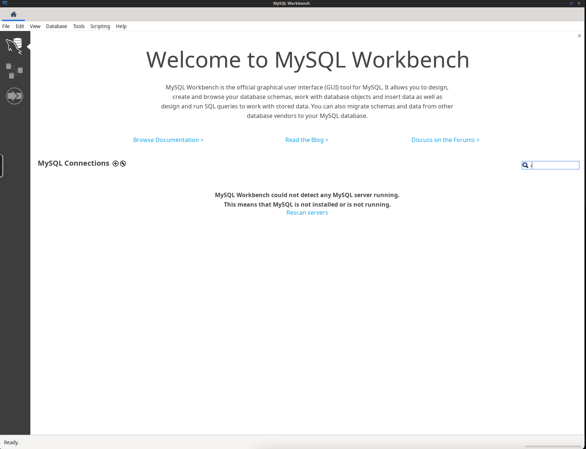

<!-- generated -->

# MySQL-Workbench

1-Click installation template for MySQL-Workbench on Easypanel

## Description

MySQL Workbench is a unified visual tool for database architects, developers, and DBAs. It provides data modeling, SQL development, and comprehensive database management capabilities for MySQL and MariaDB. With MySQL Workbench, you can design and create new databases, reverse-engineer existing databases, and perform complex migrations. It offers a visual query builder, a powerful SQL editor, and support for data modeling and schema creation. MySQL Workbench is a trusted, easy-to-use tool to streamline database operations and improve productivity.

## Benefits

- Unified Database Management: MySQL Workbench integrates modeling, development, and administration into a single tool for managing MySQL and MariaDB databases efficiently.
- Visual Data Modeling: MySQL Workbench allows you to visually design and model your database structure with ease, making it simple to create or reverse-engineer schemas.
- Advanced SQL Editor: It provides a powerful SQL editor with syntax highlighting, code completion, and query execution for streamlined database management.
- Schema Synchronization: MySQL Workbench helps you synchronize schemas across different databases with a few clicks, reducing manual errors.
- Cross-Platform Support: MySQL Workbench is available on Windows, macOS, and Linux, ensuring cross-platform compatibility.

## Features

- Visual Query Builder: Build and execute queries visually without writing complex SQL manually.
- Database Migration: Migrate databases seamlessly between MySQL and other database systems like PostgreSQL or Oracle.
- Performance Monitoring: Monitor database performance metrics and optimize queries for improved efficiency.
- Secure Connections: Use SSH tunneling and SSL to establish secure connections with your databases.
- Data Import & Export: Easily import and export data in various formats like CSV and JSON.
- Data Modeling: Create complex ER diagrams and visually design schemas for databases.
- Backup and Restore: Create backups of your databases and restore them easily when needed.
- Open Source: MySQL Workbench is open-source, making it accessible and customizable for your needs.
- Collaboration Support: Share models and configurations with your team to streamline collaboration.

## Links

- [Website](https://www.mysql.com/products/workbench/)
- [Documentation](https://dev.mysql.com/doc/workbench/en/)
- [Github](https://github.com/mysql/mysql-workbench)
- [Template Source](https://github.com/easypanel-io/templates/tree/main/templates/mysql-workbench)

## Options

Name | Description | Required | Default Value
-|-|-|-
App Service Name | - | yes | mysql-workbench
App Service Image | - | yes | lscr.io/linuxserver/mysql-workbench:latest

## Screenshots

## Change Log

- 2024-12-30 – First Release

## Contributors

- [Ahson Shaikh](https://github.com/Ahson-Shaikh)
