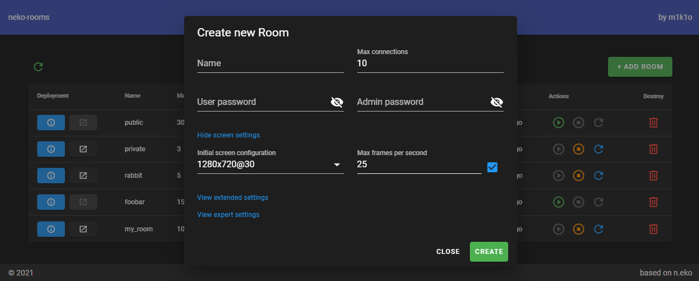

<!-- generated -->

# Neko Rooms

1-Click installation template for Neko Rooms on Easypanel

## Description

Neko Rooms is a self-hosted, collaborative virtualized browser-sharing platform that enables users to share and interact with web applications in a fully isolated and secure environment. It allows multiple users to join a shared session, providing seamless co-browsing experiences with synchronized interactions. Neko Rooms is built for teams, support agents, and anyone needing real-time, interactive browsing collaboration. It is optimized for low-latency streaming and supports multiple configurations for enhanced flexibility and performance.

## Benefits

- Secure Remote Browsing: Neko Rooms provides a fully isolated, secure browsing environment, preventing data leaks and ensuring privacy for collaborative sessions.
- Real-Time Collaboration: Share your browser session with multiple users in real time, enabling co-browsing, presentations, and collaborative web interactions.
- Multi-User Support: Neko Rooms allows multiple users to join the same session, interact simultaneously, and work together on web applications.

## Features

- Low-Latency Streaming: Optimized for minimal delay, ensuring smooth and responsive browsing sessions for all participants.
- Multi-User Synchronization: Keep all participants synchronized with shared controls, allowing seamless interaction within the session.
- Customizable Environment: Configure your instance with various settings, including network policies, session persistence, and resource limits.
- Secure Containerization: Neko Rooms runs in a secure, containerized environment to ensure complete isolation from the host system.
- Integration with Reverse Proxies: Supports integration with Traefik, NGINX, and other reverse proxies for better scalability and access management.

## Links

- [Github](https://github.com/m1k1o/neko-rooms)
- [Template Source](https://github.com/easypanel-io/templates/tree/main/templates/neko-rooms)

## Options

Name | Description | Required | Default Value
-|-|-|-
App Service Name | - | yes | neko-rooms
App Service Image | - | yes | m1k1o/neko-rooms:1.6.4

## Screenshots

## Change Log

- 2025-03-14 – First Release
- 2025-12-29 – Version bumped to 1.6.4

## Contributors

- [Ahson Shaikh](https://github.com/Ahson-Shaikh)
