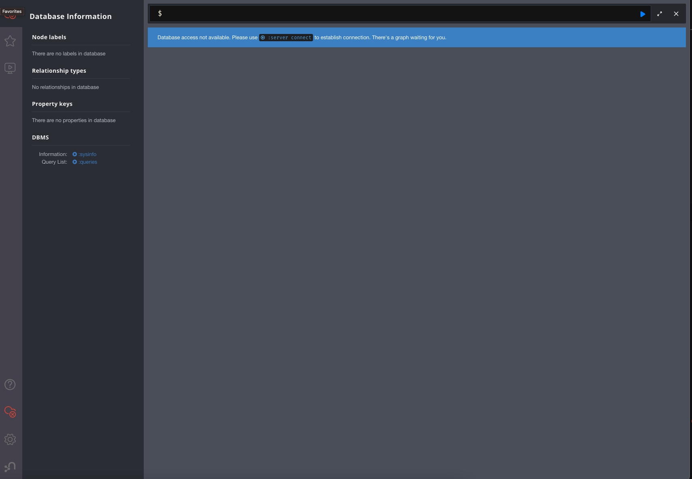

<!-- generated -->

# Neo4j

1-Click installation template for Neo4j on Easypanel

## Description

Neo4j is a native graph database that brings data relationships to the foreground. It&#39;s designed to store, manage, and analyze connected data efficiently. Neo4j is particularly well-suited for applications that need to model complex relationships between entities, such as social networks, recommendation engines, fraud detection, and knowledge graphs.

## Benefits

- Native Graph Database: Optimized for storing and querying connected data.
- Powerful Query Language: Cypher query language for intuitive graph operations.
- Scalability: Scale horizontally and vertically as needed.
- Rich Ecosystem: Extensive tools, libraries, and integrations.

## Features

- Graph Database: Native graph storage and processing.
- ACID Compliance: Full ACID compliance for data consistency.
- Browser Interface: User-friendly web interface for database management.
- Plugin Support: Extensible through custom plugins.

## Links

- [Website](https://neo4j.com/)
- [Documentation](https://neo4j.com/docs/)
- [Docker Hub](https://hub.docker.com/_/neo4j)
- [Template Source](https://github.com/easypanel-io/templates/tree/main/templates/neo4j)

## Options

Name | Description | Required | Default Value
-|-|-|-
App Service Name | - | yes | neo4j
Neo4j Image | - | yes | neo4j:5.26.19
Neo4j Password | Password for the neo4j user | yes | password
Neo4j User | User for the neo4j database | yes | neo4j

## Screenshots

## Change Log

- 2025-03-26 – Initial template release
- 2025-07-24 – Update to Neo4j 5.26.9
- 2025-12-29 – Version bumped to 5.26.19

## Contributors

- [Ahson Shaikh](https://github.com/Ahson-Shaikh)
