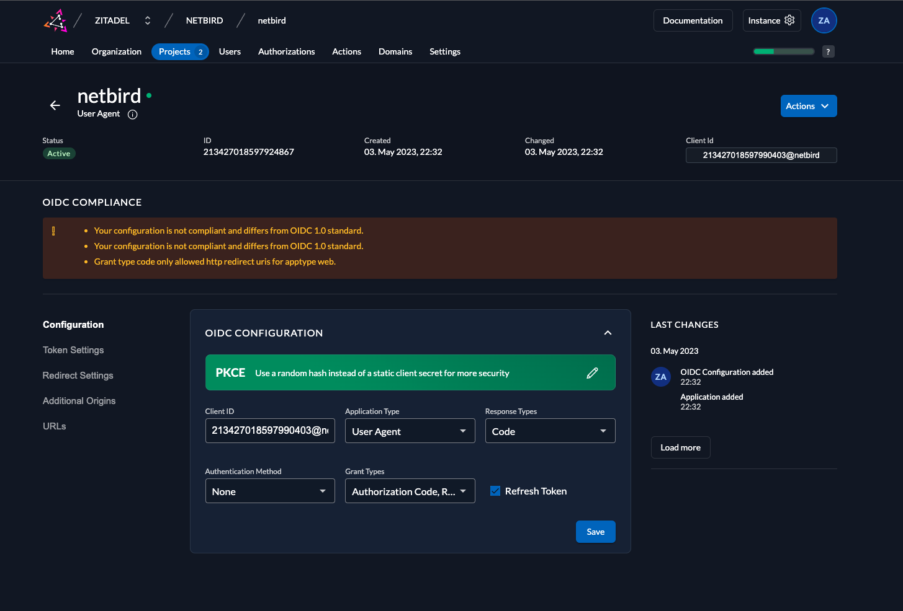

<!-- generated -->

# NetBird

1-Click installation template for NetBird on Easypanel

## Description

This template deploys a headless NetBird client/peer container that joins an existing NetBird network using a setup key. It does not deploy the NetBird management service, signal relay, or web dashboard. Use it to bootstrap a node on your private mesh for remote access, site-to-site connectivity, or secure service reachability over WireGuard.

## Instructions

This template runs only the NetBird client (peer). Before deploying, create an account at https://netbird.io or run your own NetBird management stack, then generate a reusable setup key. Enter that key in the NB_SETUP_KEY field during deployment. The container will join your existing NetBird network and persist client state in /var/lib/netbird.

## Benefits

- Zero Configuration VPN: Automatically creates secure peer-to-peer connections without complex VPN server setup or port forwarding.
- WireGuard Performance: Built on modern WireGuard protocol providing superior speed and security compared to traditional VPN solutions.
- NAT Traversal: Automatically punches through NAT and firewalls to establish direct connections between peers whenever possible.
- Mesh Network Topology: Creates a decentralized mesh network where devices communicate directly, reducing latency and single points of failure.

## Features

- Peer-to-Peer Connectivity: Direct device-to-device connections within your private network with automatic peer discovery and connection.
- Secure Encryption: End-to-end encryption using WireGuard's state-of-the-art cryptography for all network traffic between peers.
- Cross-Platform Support: Connect devices across different platforms and networks into a unified secure private network.
- Network Management: Centralized management dashboard for controlling access, monitoring connections, and managing your private network.

## Links

- [Website](https://netbird.io)
- [Documentation](https://docs.netbird.io)
- [GitHub](https://github.com/netbirdio/netbird)
- [Template Source](https://github.com/easypanel-io/templates/tree/main/templates/netbird)

## Options

Name | Description | Required | Default Value
-|-|-|-
App Service Name | - | yes | netbird
App Service Image | - | yes | netbirdio/netbird:0.59.6
NetBird Setup Key | Setup key from your NetBird dashboard to connect this client | yes | 

## Screenshots

## Change Log

- 2025-10-14 – Initial Template Release

## Contributors

- [Ahson Shaikh](https://github.com/Ahson-Shaikh)
