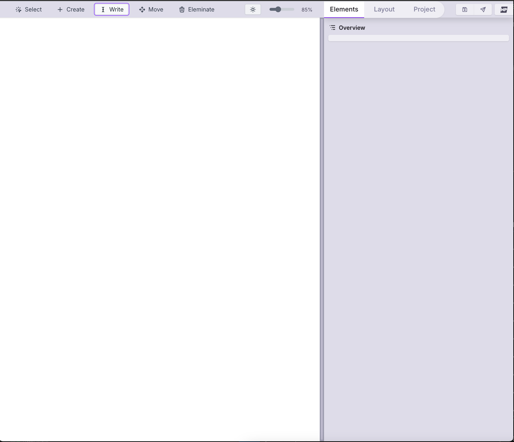

<!-- generated -->

# Nitropage

1-Click installation template for Nitropage on Easypanel

## Description

Nitropage is an extensible, drag-and-drop website builder based on SolidStart, designed for individualists who want complete control over their web design. It is completely free and open source, offering a flexible and intuitive platform for building visually stunning websites without coding. Nitropage supports modular extensions, making it ideal for both beginners and advanced users who seek a personalized and efficient web development experience.

## Benefits

- Drag-and-Drop Simplicity: Create beautiful websites effortlessly with Nitropage’s drag-and-drop editor, perfect for users of all skill levels.
- Free and Open Source: Enjoy the freedom of an open-source platform with no licensing costs.
- SolidStart Framework: Built on the SolidStart framework, ensuring a fast and responsive user experience.

## Features

- Visual Website Editing: Design and customize websites in real-time with a powerful visual editor.
- Customizable Themes: Choose from a variety of themes and customize them to fit your unique style and branding.
- Lightweight and Fast: Nitropage ensures your websites load quickly, providing a smooth user experience.
- Responsive Design: Build mobile-friendly websites that look great on any device.
- Version Control: Track changes and revert to previous versions with built-in version control.
- Solid Integration: Seamlessly integrate with the SolidStart framework for modern web development.

## Links

- [Website](https://nitropage.com/)
- [Documentation](https://nitropage.com/docs)
- [Github](https://codeberg.org/nitropage/nitropage)
- [Template Source](https://github.com/easypanel-io/templates/tree/main/templates/nitropage)

## Options

Name | Description | Required | Default Value
-|-|-|-
App Service Name | - | yes | nitropage
App Service Image | - | yes | codeberg.org/nitropage/nitropage:sqlite

## Screenshots

## Change Log

- 2025-01-10 – Initial Template Release

## Contributors

- [Ahson Shaikh](https://github.com/Ahson-Shaikh)
