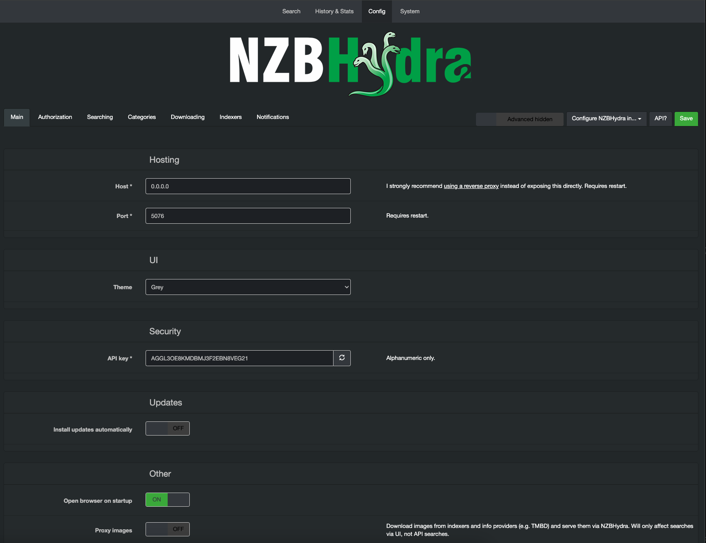

<!-- generated -->

# Nzbhydra2

1-Click installation template for Nzbhydra2 on Easypanel

## Description

NZBHydra2 is an advanced meta search application designed to unify and manage searches across multiple Usenet and torrent indexers. It acts as a single access point for all your NZB and torrent needs, aggregating search results from various indexers to save time and improve efficiency. NZBHydra2 offers powerful filtering, duplicate management, and easy integration with automation tools like Sonarr, Radarr, and Lidarr. It provides a web-based interface for seamless configuration and search management, making it a must-have for Usenet and torrent enthusiasts.

## Benefits

- Unified Search: NZBHydra2 consolidates search results from multiple Usenet and torrent indexers, providing a single interface for all your search needs.
- Easy Integration: Integrates seamlessly with popular automation tools like Sonarr, Radarr, and Lidarr for an automated media setup.
- Advanced Filtering: Powerful filtering options to refine search results and download only the content you want.
- Duplicate Management: Automatically identifies and removes duplicate results to avoid unnecessary downloads.
- Web-Based Interface: Manage and configure NZBHydra2 from any device using its user-friendly web interface.

## Features

- Meta Search for NZBs and Torrents: Search multiple Usenet and torrent indexers simultaneously from a single application.
- Customizable Filters: Set up custom filters to fine-tune search results and downloads based on your preferences.
- Indexer Statistics: View detailed statistics about indexer performance, including response times and search results.
- Automation Tool Integration: Works with Sonarr, Radarr, Lidarr, and other tools to automate downloading and managing your media.
- Proxy Support: Includes support for proxies to maintain privacy and bypass regional restrictions.
- Logging and Notifications: Comprehensive logging and notification options to keep you informed about search results and downloads.
- Advanced Duplicate Handling: Automatically detects and manages duplicates to avoid redundant downloads.
- Backup and Restore: Easily backup and restore your NZBHydra2 settings for hassle-free migration or recovery.
- Multi-Indexer Support: Supports a wide range of Usenet and torrent indexers for comprehensive search capabilities.
- Performance Optimization: Optimized for high performance with fast search results and minimal resource usage.

## Links

- [Website](https://github.com/theotherp/nzbhydra2)
- [Documentation](https://github.com/theotherp/nzbhydra2/wiki)
- [Github](https://github.com/theotherp/nzbhydra2)
- [Template Source](https://github.com/easypanel-io/templates/tree/main/templates/nzbhydra2)

## Options

Name | Description | Required | Default Value
-|-|-|-
App Service Name | - | yes | nzbhydra2
App Service Image | - | yes | lscr.io/linuxserver/nzbhydra2:latest

## Screenshots

## Change Log

- 2024-12-31 – First Release

## Contributors

- [Ahson Shaikh](https://github.com/Ahson-Shaikh)
