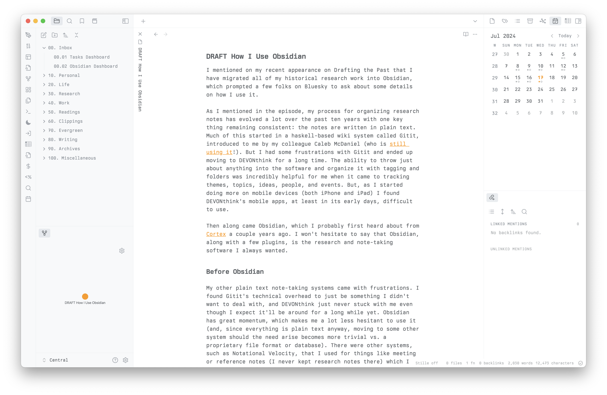

<!-- generated -->

# Obsidian

1-Click installation template for Obsidian on Easypanel

## Description

Obsidian is a powerful knowledge base that works on top of a local folder of plain text Markdown files. It provides a flexible and extensible platform for note-taking, knowledge management, and personal knowledge base creation.

## Benefits

- Knowledge Management: Organize and manage your knowledge effectively
- Markdown Support: Write and format notes using Markdown
- Graph View: Visualize connections between your notes
- Self-Hosted: Keep your notes private and secure

## Features

- Note Taking: Create and organize notes in Markdown
- Knowledge Graph: Visualize connections between notes
- Plugins: Extend functionality with plugins
- Search: Powerful search across all notes
- Sync: Sync your notes across devices

## Links

- [Website](https://obsidian.md)
- [Documentation](https://help.obsidian.md)
- [Template Source](https://github.com/easypanel-io/templates/tree/main/templates/obsidian)

## Options

Name | Description | Required | Default Value
-|-|-|-
App Service Name | - | yes | obsidian
App Service Image | - | yes | lscr.io/linuxserver/obsidian:1.8.9

## Screenshots

## Change Log

- 2025-04-11 – First Release

## Contributors

- [Ahson Shaikh](https://github.com/Ahson-Shaikh)
