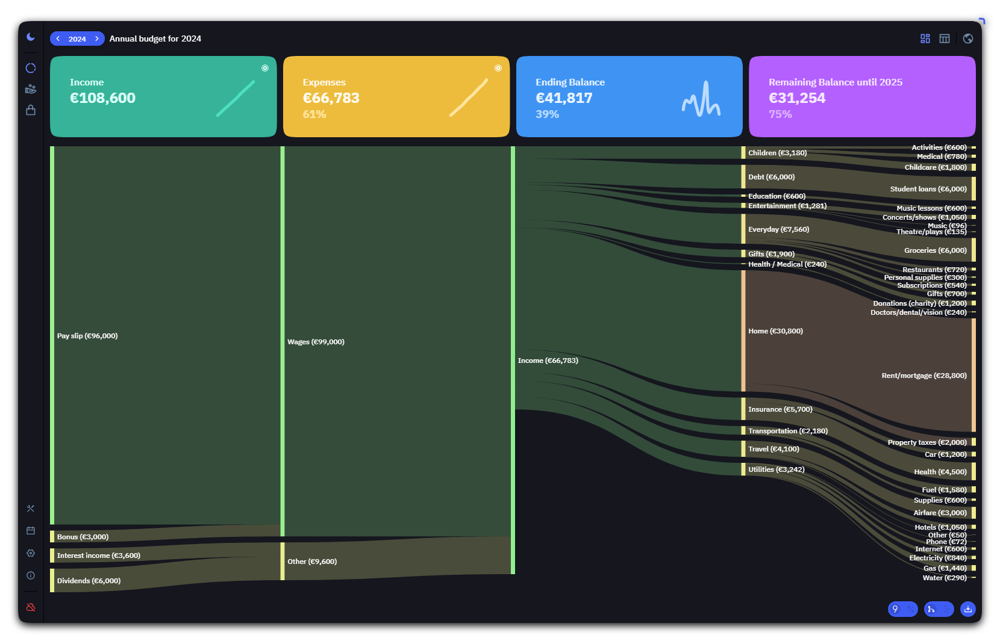

<!-- generated -->

# Ocular

1-Click installation template for Ocular on Easypanel

## Description

Ocular is a self-hosted budget and finance app with dashboards, charts, multi-year tracking, imports, and authentication. This template runs the official container image, which bundles the static UI (Caddy) and the Genesis API backend, with persistent data under /data/genesis.

## Instructions

After deploy, open your domain and sign in using the initial user from GENESIS_CREATE_USERS (default is admin with a random password set at deploy time; copy it from the service environment if you did not set your own value). Use HTTPS in production; only enable HTTP cookies if you access the app without TLS. Change GENESIS_JWT_SECRET only if you understand that existing sessions will be invalidated.

## Benefits

- Budget clarity: Dashboards and analytics help you understand spending and plans over time.
- Self-hosted: Keep financial data on infrastructure you control.
- Official image: Uses the published GHCR image maintained by the project.

## Features

- Multi-year budgets: Track and carry budgets across years with flexible financial calendars.
- Import and export: Bring data from common formats and export your work as JSON.
- Genesis backend: API and authentication via the bundled Genesis server (JWT configurable).

## Links

- [Website](https://simonwep.github.io/ocular/)
- [Documentation](https://simonwep.github.io/ocular/pages/quickstart)
- [Deploy guide](https://simonwep.github.io/ocular/pages/deploy.html)
- [GitHub](https://github.com/simonwep/ocular)
- [Container registry](https://github.com/simonwep/ocular/pkgs/container/ocular)
- [Template Source](https://github.com/easypanel-io/templates/tree/main/templates/ocular)

## Options

Name | Description | Required | Default Value
-|-|-|-
App Service Name | - | yes | ocular
Ocular Image | - | yes | ghcr.io/simonwep/ocular:v2.3.0
JWT token expiration (ms) | - | no | 120000
Allow JWT cookie over HTTP (not recommended behind HTTPS) | - | no | false
Initial users (Genesis format) | Comma-separated list of username!:password entries. Leave empty to create a single admin user with a random password. | no | 

## Screenshots

## Change Log

- 2026-04-06 – Initial template release

## Contributors

- [Ahson Shaikh](https://github.com/Ahson-Shaikh)
