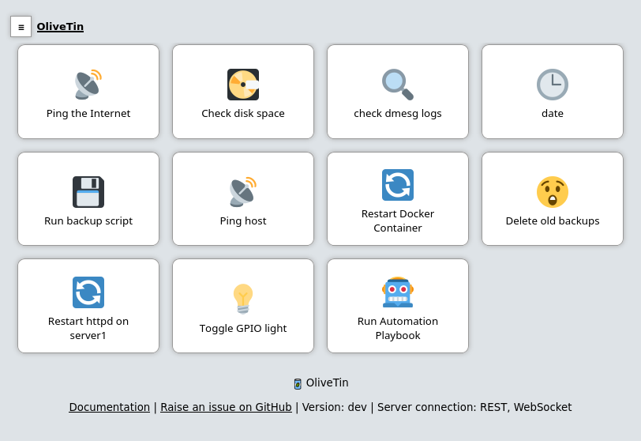

<!-- generated -->

# OliveTin

1-Click installation template for OliveTin on Easypanel

## Description

OliveTin is a web interface for running Linux shell commands. It provides a simple, elegant dashboard that lets you execute predefined commands with a single click. Perfect for system administrators, home automation enthusiasts, or anyone who wants to simplify repetitive tasks without memorizing complex command-line syntax. OliveTin is lightweight, secure, and highly customizable, allowing you to create buttons for anything from system maintenance to home automation controls.

## Benefits

- Simple Command Execution: Transform complex shell commands into simple buttons on a clean web interface, making system administration tasks accessible to users of all skill levels.
- Secure Delegation: Allow others to execute specific commands without giving them full shell access, ensuring security while enabling collaboration.
- Streamlined Workflows: Organize frequently used commands into an intuitive dashboard, saving time and reducing errors in routine tasks.

## Features

- Web Dashboard: Access your predefined commands through a clean, responsive web interface that works on desktop and mobile devices.
- Customizable Commands: Define any shell command as a button with parameters, descriptions, and visual customizations to create a personalized control panel.
- Actionable Output: View the output of your commands directly in the web interface, with proper formatting and error reporting.
- Lightweight Footprint: Run OliveTin with minimal resource usage, making it ideal for both powerful servers and resource-constrained environments.
- YAML Configuration: Configure your command buttons using simple YAML files, making setup and modification straightforward and version-controllable.

## Links

- [GitHub](https://github.com/OliveTin/OliveTin)
- [Documentation](https://docs.olivetin.app)
- [Docker Hub](https://hub.docker.com/r/jamesread/olivetin)
- [Template Source](https://github.com/easypanel-io/templates/tree/main/templates/olivetin)

## Options

Name | Description | Required | Default Value
-|-|-|-
App Service Name | - | yes | olivetin
App Service Image | - | yes | jamesread/olivetin:3000.11.3

## Screenshots

## Change Log

- 2025-04-18 – first release
- 2026-05-05 – Version bumped to 3000.11.3

## Contributors

- [Ahson Shaikh](https://github.com/Ahson-Shaikh)
