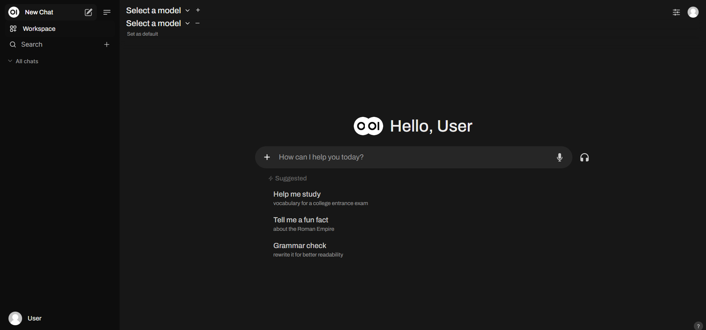

<!-- generated -->

# Ollama

1-Click installation template for Ollama on Easypanel

## Description

Ollama is a powerful tool designed to simplify the deployment and interaction with advanced AI models. It provides a streamlined solution for managing and hosting large language models (LLMs) with an intuitive interface. Ollama allows users to run queries and interact with models like OpenAI GPT and others in a secure and efficient manner. The tool includes a web-based interface that makes managing and testing models straightforward. Ollama is designed to support diverse use cases, from research and development to deploying AI capabilities in production systems. It offers flexible deployment options, powerful API integrations, and role-based access control to ensure secure and scalable AI solutions.

## Benefits

- Simplified AI Deployment: Ollama makes it easy to deploy and manage advanced AI models, enabling users to focus on building and scaling AI applications efficiently.
- Secure Model Hosting: Host AI models with enterprise-grade security, ensuring data privacy and role-based access control for users and teams.
- Intuitive Web Interface: Ollama provides a user-friendly web interface for managing AI models, running queries, and testing capabilities without hassle.
- Flexible Deployment Options: Deploy Ollama on your preferred infrastructure, whether it's cloud-based or on-premises, to suit your organizational needs.
- API Integrations: Ollama offers robust APIs for seamless integration with existing applications and workflows, enabling AI-powered automation.

## Features

- Manage AI Models: Deploy, configure, and manage AI models effortlessly with Ollama’s streamlined interface and tools.
- Interactive Query System: Run queries and interact with hosted models to leverage AI for tasks like natural language processing, data generation, and more.
- Web-Based UI: Access a secure, feature-rich web UI to manage your AI models and interact with them in real-time.
- Scalable Architecture: Scale your AI deployments to handle increasing workloads without compromising performance or security.
- Role-Based Access Control: Control who can access and interact with the AI models using role-based access permissions.

## Links

- [Website](https://ollama.com)
- [Docs](https://docs.ollama.com)
- [Github](https://github.com/Ollama/Ollama)
- [Template Source](https://github.com/easypanel-io/templates/tree/main/templates/ollama)

## Options

Name | Description | Required | Default Value
-|-|-|-
App Service Name | - | yes | ollama
App Service Image | - | yes | ollama/ollama:0.3.6
Ollama UI Service Image | - | yes | ghcr.io/open-webui/open-webui:v0.3.35
Ollama UI Name | - | yes | Ollama

## Screenshots

## Change Log

- 2024-11-16 – First Release

## Contributors

- [Ahson Shaikh](https://github.com/Ahson-Shaikh)
