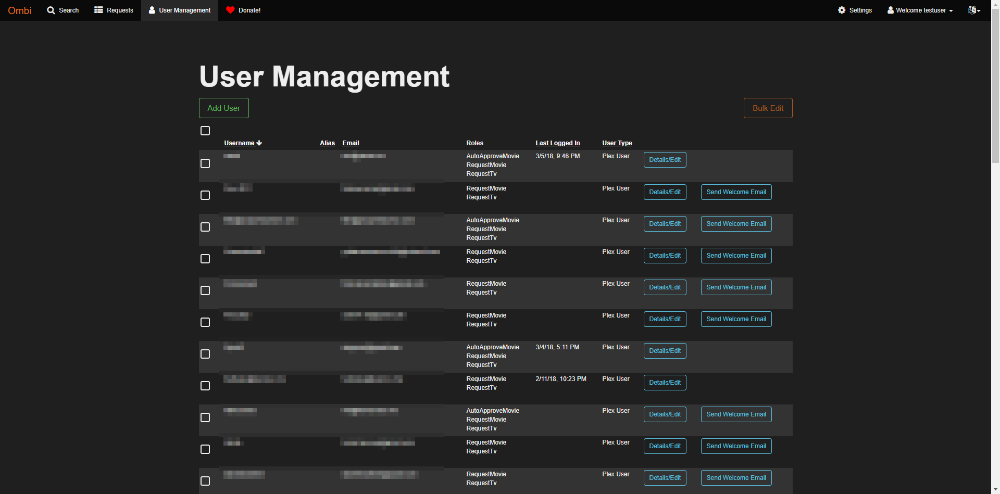

<!-- generated -->

# Ombi

1-Click installation template for Ombi on Easypanel

## Description

Ombi allows you to host your own Plex Request and user management system. If you are sharing your Plex server with other users, allow them to request new content using an easy to manage interface! Manage all your requests for Movies and TV with ease, leave notes for the user and get notification when a user requests something. Allow your users to post issues against their requests so you know there is a problem with the audio etc. Even automatically send them weekly newsletters of new content that has been added to your Plex server!

## Links

- [Website](https://ombi.io/)
- [Documentation](https://docs.linuxserver.io/images/docker-ombi/)
- [Github](https://github.com/linuxserver/docker-ombi)
- [Template Source](https://github.com/easypanel-io/templates/tree/main/templates/ombi)

## Options

Name | Description | Required | Default Value
-|-|-|-
App Service Name | - | yes | ombi
App Service Image | - | yes | linuxserver/ombi:4.44.1
Timezone | - | no | Etc/UTC

## Screenshots

## Change Log

- 2024-11-27 – first release

## Contributors

- [Serban Alexandru](https://github.com/serban-alexandru)
