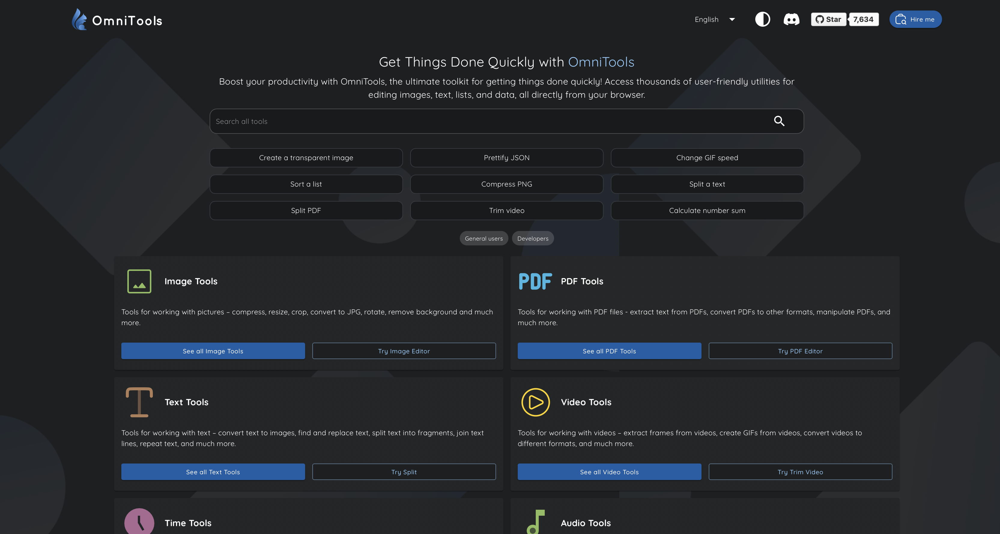

<!-- generated -->

# Omni Tools

1-Click installation template for Omni Tools on Easypanel

## Description

Omni Tools is a comprehensive collection of web-based utilities and tools designed to simplify everyday tasks for developers, designers, and general users. It provides a unified interface for accessing dozens of useful tools including text converters, encoders/decoders, formatters, generators, calculators, image processors, and more. With no need for installation or external dependencies, Omni Tools offers instant access to commonly needed utilities without leaving your browser. The self-hosted solution ensures your data remains private and never leaves your infrastructure, making it ideal for handling sensitive information. All tools run entirely in the web interface with a clean, intuitive design that makes finding and using utilities effortless. Perfect for development teams, content creators, system administrators, and anyone who regularly needs quick access to conversion, formatting, encoding, or calculation tools without relying on multiple online services or installing separate applications.

## Benefits

- All-in-One Utility Suite: Access dozens of commonly needed tools from a single interface, eliminating the need to search for and switch between multiple online services.
- Privacy-Focused: Self-hosted solution ensures your data never leaves your infrastructure, making it safe to process sensitive information.
- Zero Installation: Browser-based tools require no software installation or plugins, providing instant access from any device with a web browser.

## Features

- Text Processing: Convert, format, and manipulate text with tools for case conversion, encoding/decoding, formatting, and text generation.
- Data Converters: Convert between different data formats, number systems, units of measurement, and character encodings with ease.
- Encoders and Decoders: Encode and decode various formats including Base64, URL encoding, HTML entities, JWT tokens, and cryptographic hashes.
- Code Formatters: Format and beautify code in multiple languages including JSON, XML, HTML, CSS, JavaScript, and SQL for better readability.
- Generators: Generate random data, passwords, UUIDs, lorem ipsum text, QR codes, and other commonly needed values for development and testing.
- Calculators: Perform various calculations including mathematical operations, date/time conversions, and specialized calculations for different use cases.

## Links

- [Website](https://omnitools.app)
- [GitHub](https://github.com/iib0011/omni-tools)
- [Documentation](https://github.com/iib0011/omni-tools#readme)
- [Releases](https://github.com/iib0011/omni-tools/releases)
- [Docker Hub](https://hub.docker.com/r/iib0011/omni-tools)
- [Template Source](https://github.com/easypanel-io/templates/tree/main/templates/omnitools)

## Options

Name | Description | Required | Default Value
-|-|-|-
App Service Name | - | yes | omnitools
App Service Image | - | yes | iib0011/omni-tools:0.6.0

## Screenshots

## Change Log

- 2025-11-24 – Template Release
- 2026-03-25 – Added missing links and pinned image from 0.6 to 0.6.0

## Contributors

- [Ahson Shaikh](https://github.com/Ahson-Shaikh)
