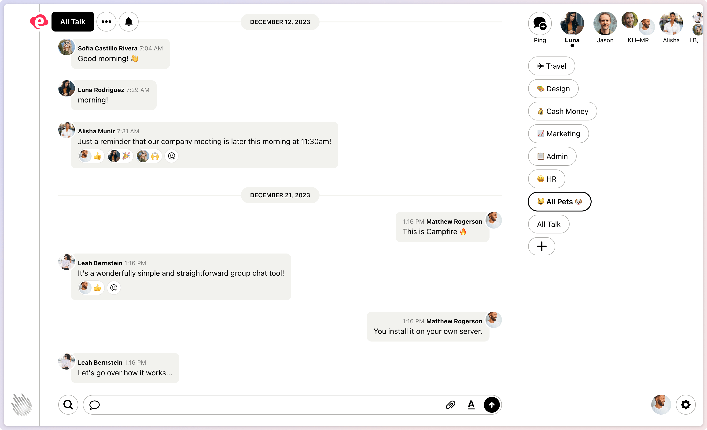

<!-- generated -->

# Once Campfire

1-Click installation template for Once Campfire on Easypanel

## Description

Once Campfire is a modern, open-source team communication platform built by Basecamp. It provides a simple and intuitive interface for team messaging, file sharing, and collaboration. Once Campfire offers real-time messaging, threaded conversations, file uploads, and search functionality in a clean, distraction-free environment. It&#39;s designed to help teams communicate effectively without the complexity of larger enterprise platforms.

## Instructions

Setup the initial user and start using the app.

## Benefits

- Simple Team Communication: Clean, intuitive interface for team messaging without the complexity of enterprise platforms, focusing on essential communication features.
- Real-Time Messaging: Instant messaging capabilities with real-time updates and notifications to keep your team connected and informed.
- File Sharing: Easy file upload and sharing capabilities to collaborate on documents, images, and other files within your team conversations.
- Threaded Conversations: Organized discussions with threaded conversations to keep topics organized and make it easy to follow specific discussions.

## Features

- Modern Interface: Clean, modern web interface designed for productivity and ease of use across desktop and mobile devices.
- Search Functionality: Powerful search capabilities to find messages, files, and conversations quickly across your team's communication history.
- Team Management: Easy team member management with invitation system and user roles for organized team communication.
- Open Source: Open-source platform that you can customize and extend according to your team's specific needs and requirements.
- Self-Hosted: Complete control over your team's communication data with self-hosted deployment and no external dependencies.
- Lightweight: Lightweight application that runs efficiently with minimal resource requirements, perfect for small to medium teams.

## Links

- [GitHub](https://github.com/basecamp/once-campfire)
- [Template Source](https://github.com/easypanel-io/templates/tree/main/templates/once-campfire)

## Options

Name | Description | Required | Default Value
-|-|-|-
App Service Name | - | yes | once-campfire
App Service Image | Once Campfire Docker image | yes | ghcr.io/basecamp/once-campfire:sha-d7c6727

## Screenshots

## Change Log

- 2025-09-10 – Initial Template Release (sha-d7c6727)

## Contributors

- [Ahson Shaikh](https://github.com/Ahson-Shaikh)
