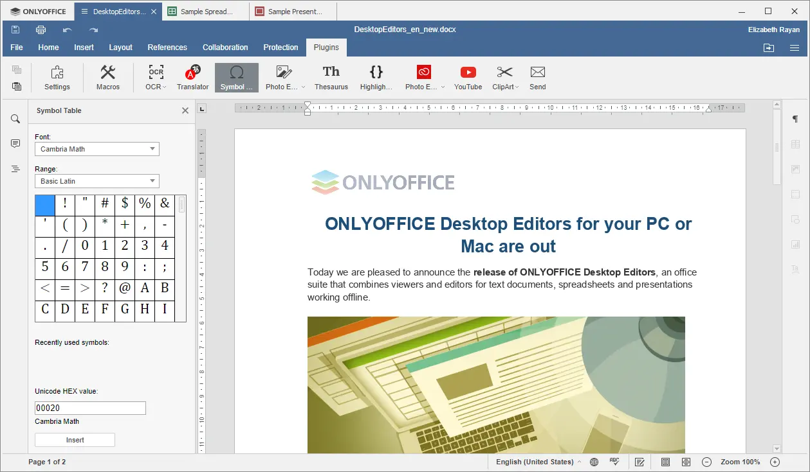

<!-- generated -->

# OnlyOffice

1-Click installation template for OnlyOffice on Easypanel

## Description

OnlyOffice is a self-hosted office suite that provides powerful document, spreadsheet, and presentation editing capabilities. It offers full compatibility with Microsoft Office formats and allows real-time document collaboration. Designed for businesses, teams, and individuals, OnlyOffice ensures secure, private, and efficient document management. It includes integration with various cloud storage services, supports plugins for extended functionality, and provides a modern web-based interface. OnlyOffice can be deployed on-premise or in the cloud and is ideal for organizations that need control over their document workflow. Additional features include a built-in document management system, mail integration, calendar, CRM tools, and a powerful API for automation.

## Benefits

- Full Office Suite Functionality: OnlyOffice provides a complete set of tools for creating and editing documents, spreadsheets, and presentations. It ensures compatibility with Microsoft Office formats, making it a powerful alternative for businesses and individuals.
- Real-Time Collaboration: OnlyOffice enables teams to work together on documents in real time. Users can co-edit, comment, and track changes, ensuring efficient collaboration while maintaining document integrity.
- Self-Hosted & Secure: OnlyOffice can be deployed on your own server, ensuring full control over your data. It supports encryption, access permissions, and integration with identity management systems for enhanced security.

## Features

- Microsoft Office Compatibility: OnlyOffice supports and maintains full compatibility with DOCX, XLSX, and PPTX formats, allowing seamless document exchange between users of different office suites.
- Integrated Document Management: Includes a built-in document management system that enables file organization, sharing, and permission control, providing an all-in-one productivity solution.
- Plugin Support: Extend OnlyOffice functionality with plugins, including features like text translation, spell checking, and document signing.
- API & Automation: OnlyOffice provides a powerful API for developers to integrate and automate document workflows, making it highly customizable for enterprise needs.
- Multi-Platform Access: With web, desktop, and mobile applications, OnlyOffice ensures users can access their documents from any device, maintaining productivity on the go.

## Links

- [Documentation](https://helpcenter.onlyoffice.com/)
- [Github](https://github.com/ONLYOFFICE)
- [Template Source](https://github.com/easypanel-io/templates/tree/main/templates/onlyoffice)

## Options

Name | Description | Required | Default Value
-|-|-|-
App Service Name | - | yes | onlyoffice
App Service Image | - | yes | onlyoffice/documentserver:9.2

## Screenshots

## Change Log

- 2025-02-26 – first release
- 2025-12-29 – Version bumped to 9.2

## Contributors

- [Ahson Shaikh](https://github.com/Ahson-Shaikh)
