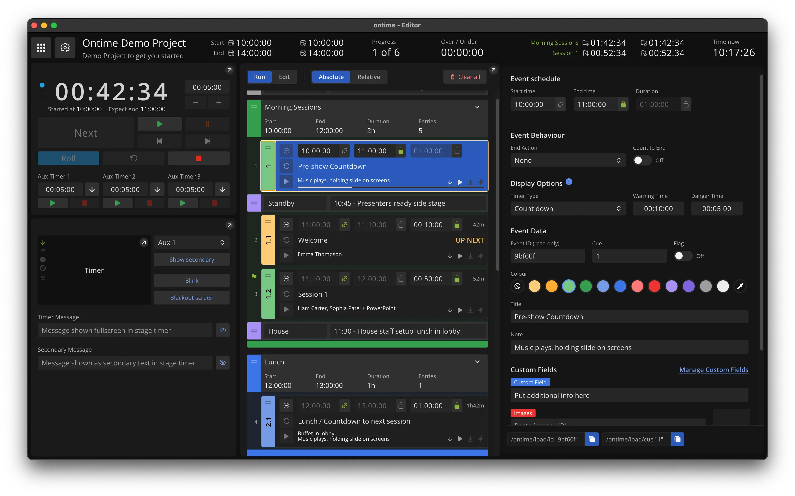

<!-- generated -->

# Ontime

1-Click installation template for Ontime on Easypanel

## Description

Ontime is free, open-source software for managing rundowns and event timers. Real-time rundown and timer management for broadcast and live events. Multi-device web access, delay workflow management, team collaboration, and automated or operator-controlled playback. HTTP API, WebSockets, and OSC (Open Sound Control) for integration with Qlab, OBS, disguise, and other tools.

## Instructions

After deployment, access the web UI on your assigned domain. Port 4001 serves
the web interface and WebSockets. Ports 8888 and 9999 (UDP) are for OSC input
and output—expose them if you need external control integration.

## Benefits

- Rundown Management: Real-time rundown and event timer control
- Multi-Device: Access from any device via web browser
- Integration Ready: HTTP API, WebSockets, OSC for external control
- Lightweight: ~58 MB image; runs on Raspberry Pi or cloud

## Features

- Web UI & WebSockets: Port 4001 for interface and real-time data
- OSC Support: Ports 8888 (input) and 9999 (output) for protocol control
- Delay Workflows: Manage broadcast delays and operator-controlled playback
- Team Collaboration: Real-time collaboration across devices

## Links

- [Website](https://www.getontime.no/)
- [GitHub](https://github.com/cpvalente/ontime)
- [Documentation](https://docs.getontime.no/)
- [Docker Hub](https://hub.docker.com/r/getontime/ontime)
- [Template Source](https://github.com/easypanel-io/templates/tree/main/templates/ontime)

## Options

Name | Description | Required | Default Value
-|-|-|-
App Service Name | - | yes | ontime
App Service Image | - | yes | getontime/ontime:v4.7.0
OSC Input Port | - | no | 8888
OSC Output Port | - | no | 9999
Timezone | e.g. America/New_York, Europe/London, Asia/Singapore | no | UTC

## Screenshots

## Change Log

- 2026-03-17 – First Release
- 2026-03-24 – Pinned image fallback to getontime/ontime:v4.5.0 (was latest). Added Website and GitHub links.
- 2026-04-05 – Version bumped to v4.7.0

## Contributors

- [Ahson Shaikh](https://github.com/Ahson-Shaikh)
