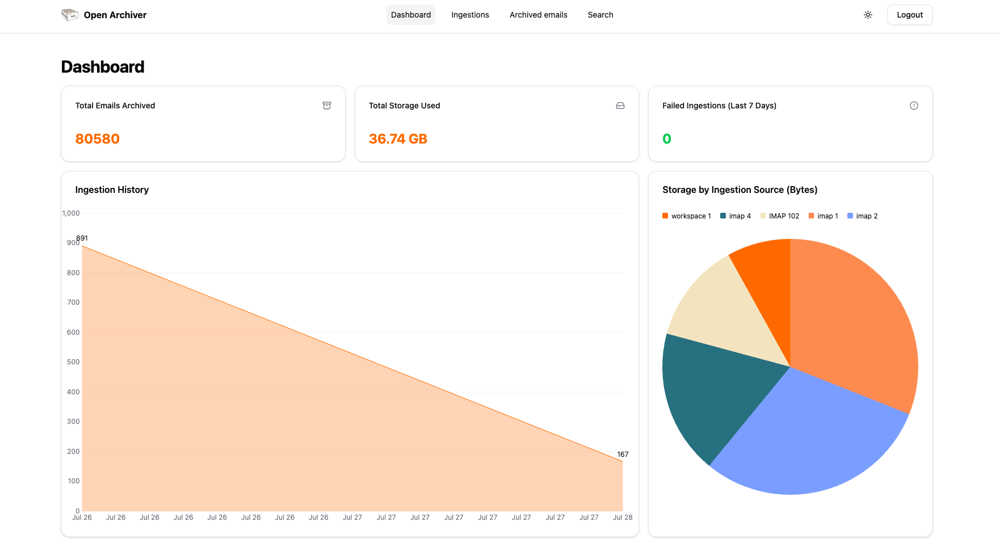

<!-- generated -->

# Open Archiver

1-Click installation template for Open Archiver on Easypanel

## Description

Open Archiver is a secure, sovereign, and open-source platform for email archiving and eDiscovery. It provides universal ingestion from IMAP, Google Workspace, Microsoft 365, PST files, mbox files, and zipped .eml files. Emails are stored in standard .eml format with deduplication, compression, and optional AES-256 encryption at rest. Features include full-text search across emails and attachments (PDF, DOCX, etc.), thread discovery, file integrity verification, immutable audit trails, role-based access control, and pluggable storage backends (local or S3-compatible). Built with SvelteKit, Node.js, PostgreSQL, Meilisearch, and BullMQ.

## Instructions

After deployment, open the app URL and complete /setup as the first user.
Secrets (JWT, encryption keys, Meilisearch master key, Redis password) are
generated by the template. Configure ingestion sources from the dashboard.

## Benefits

- Legally compliant email archiving: Store emails in standard .eml format with file hash verification, integrity reports, and immutable audit trails for regulatory compliance.
- Universal email ingestion: Connect to IMAP, Google Workspace, Microsoft 365, PST, mbox, and zipped .eml imports.
- Secure by design: AES-256 encryption at rest, deduplication, compression, and RBAC with fine-grained policies.
- Self-hosted & open source: AGPL-3.0; full control over your archive with no vendor lock-in.

## Features

- Full-text search: Meilisearch-backed search across email content and attachments (Tika for PDF, DOCX, etc.).
- Thread discovery: Identifies conversations and context for eDiscovery and compliance.
- Pluggable storage: Local filesystem or S3-compatible storage with optional encryption at rest.
- Integrity verification: File hashes on ingestion with integrity reports to detect tampering.
- Audit trail: Immutable logging of access and actions for accountability.
- Retention policies: Granular policies for lifecycle management of archived mail.

## Links

- [Website](https://openarchiver.com)
- [GitHub](https://github.com/LogicLabs-OU/OpenArchiver)
- [Documentation](https://docs.openarchiver.com)
- [Template Source](https://github.com/easypanel-io/templates/tree/main/templates/open-archiver)

## Options

Name | Description | Required | Default Value
-|-|-|-
App Service Name | - | yes | open-archiver
App Service Image | - | yes | logiclabshq/open-archiver:v0.4.2
Meilisearch Image | - | yes | getmeili/meilisearch:v1.15.2
Valkey Image | - | yes | valkey/valkey:8.1.6-alpine3.23
Apache Tika Image | - | yes | apache/tika:3.2.2.0-full

## Screenshots

## Change Log

- 2026-02-27 – First Release (v0.4.2)

## Contributors

- [Ahson Shaikh](https://github.com/Ahson-Shaikh)
