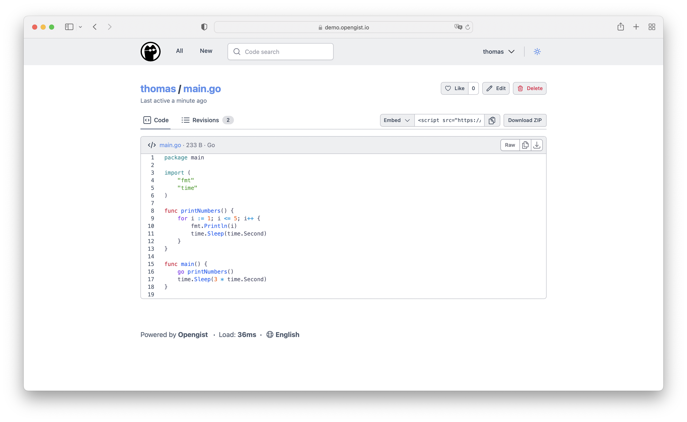

<!-- generated -->

# OpenGist

1-Click installation template for OpenGist on Easypanel

## Description

OpenGist is a self-hosted pastebin powered by Git. All snippets are stored in a Git repository and can be read and/or modified using standard Git commands, or with the web interface. It is similar to GitHub Gist, but open-source and can be self-hosted. Create public, unlisted or private snippets with syntax highlighting, search functionality, and Git integration.

## Benefits

- Git-Powered Storage: All snippets are stored in a Git repository, enabling version control, history tracking, and standard Git operations like clone, pull, and push.
- Self-Hosted Privacy: Host your own pastebin service with complete control over your data. No third-party dependencies or privacy concerns.
- GitHub Gist Alternative: Provides similar functionality to GitHub Gist but with the freedom of self-hosting and customization options.

## Features

- Multiple Snippet Types: Create public, unlisted, or private snippets with syntax highlighting support for various programming languages, markdown, and CSV files.
- Git Integration: Full Git integration allows you to clone, pull, push snippets via HTTP or SSH, making it easy to integrate with your development workflow.
- Search and Organization: Search through code snippets, browse user snippets, add topics for organization, and support for likes and forks to create a collaborative environment.
- OAuth2 Authentication: Supports OAuth2 login with GitHub, GitLab, Gitea, and OpenID Connect providers for easy user authentication and management.
- Embed and Share: Embed snippets in other websites, download raw files or as ZIP archives, and control snippet visibility for anonymous users.

## Links

- [Website](https://opengist.io/)
- [Documentation](https://opengist.io/)
- [Github](https://github.com/thomiceli/opengist)
- [Template Source](https://github.com/easypanel-io/templates/tree/main/templates/opengist)

## Options

Name | Description | Required | Default Value
-|-|-|-
App Service Name | - | yes | opengist
App Service Image | - | yes | ghcr.io/thomiceli/opengist:1.10.0

## Screenshots

## Change Log

- 2025-06-12 – First Release

## Contributors

- [Ahson Shaikh](https://github.com/Ahson-Shaikh)
