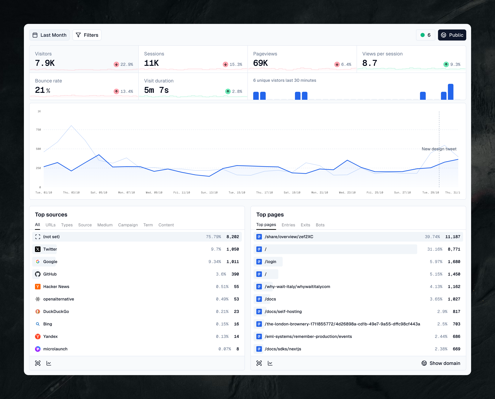

<!-- generated -->

# OpenPanel

1-Click installation template for OpenPanel on Easypanel

## Description

OpenPanel is a powerful open-source product analytics platform that helps you track and analyze user behavior. Built with modern technologies, it provides real-time insights, custom event tracking, and intuitive dashboards. Features include user segmentation, funnel analysis, retention metrics, and comprehensive reporting capabilities. Self-hosted solution that gives you full control over your data while maintaining privacy and security.

## Instructions

You have to provide the domain name in order to access the OpenPanel dashboard successfully and use the Caddy service to access the OpenPanel.

## Benefits

- Self-Hosted Analytics: Full control over your analytics data with self-hosting.
- Comprehensive Tracking: Track user behavior and product usage in detail.
- Privacy-Focused: Ensure user privacy with your own analytics infrastructure.

## Features

- User Analytics: Track and analyze user behavior across your applications.
- Event Tracking: Log and process custom events from your products.
- Interactive Dashboard: Visualize data with customizable dashboards and reports.
- Geo-Location Analytics: Track user activity by geographic location.
- Real-time Processing: Process analytics data in real-time with distributed workers.

## Links

- [Website](https://openpanel.dev/)
- [GitHub](https://github.com/Openpanel-dev/openpanel)
- [Template Source](https://github.com/easypanel-io/templates/tree/main/templates/openpanel)

## Options

Name | Description | Required | Default Value
-|-|-|-
Service Name | - | yes | openpanel
Application Domain | This is essential for the OpenPanel dashboard to work. e.g: example.com, without https:// or http:// | yes | 
API Image | - | yes | lindesvard/openpanel-api:1.0.0
Dashboard Image | - | yes | lindesvard/openpanel-dashboard:1.0.0
Worker Image | - | yes | lindesvard/openpanel-worker:1.0.0
ClickHouse Image | - | yes | clickhouse/clickhouse-server:24.3.2-alpine
GeoIP API Image | - | yes | observabilitystack/geoip-api:2025-22
Email Sender Address | - | no | noreply@example.com
Resend API Key (for email delivery) | - | no | 

## Screenshots

## Change Log

- 2025-05-30 – First release

## Contributors

- [Ahson Shaikh](https://github.com/Ahson-Shaikh)
