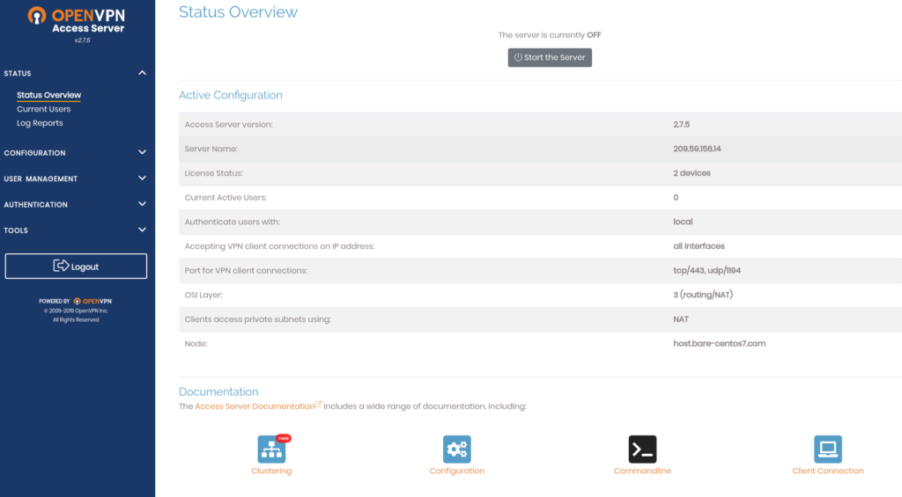

<!-- generated -->

# OpenVPN Access Server

1-Click installation template for OpenVPN Access Server on Easypanel

## Description

OpenVPN Access Server is a full-featured SSL VPN software solution that integrates OpenVPN server capabilities, enterprise-grade user management, granular access controls, and an easy-to-use web interface for administration.

## Instructions

Please use the Guide given below to get the password and access the portal. For admin portal access, use the following URL; https://$(EASYPANEL_HOST_IP):$(mgmtServicePort)/admin

## Benefits

- Enterprise-grade VPN solution: Full-featured SSL VPN with enterprise-grade user management and access controls.
- Easy web administration: User-friendly web interface for easy VPN server administration and user management.
- Secure remote access: Provide secure remote access to your network resources with strong encryption.
- Multi-platform support: Supports clients on Windows, macOS, Linux, iOS, and Android platforms.
- Flexible authentication: Support for various authentication methods including LDAP, RADIUS, and local user accounts.
- Network segmentation: Granular access controls to segment network access based on user groups and policies.

## Features

- Web-based administration: Easy-to-use web interface for server configuration and user management.
- User management: Create and manage VPN users with different access levels and permissions.
- Client configuration: Automatic client configuration generation for easy setup on various platforms.
- Network access control: Configure which network resources users can access through the VPN.
- Authentication integration: Integrate with existing authentication systems like LDAP and RADIUS.
- Monitoring and logging: Comprehensive logging and monitoring of VPN connections and activities.

## Links

- [Website](https://openvpn.net/access-server/)
- [Documentation](https://openvpn.net/vpn-server-resources/access-server-manager/)
- [Docker Hub](https://hub.docker.com/r/openvpn/openvpn-as)
- [Guide](https://openvpn.net/as-docs/docker.html#run-the-docker-container)
- [Template Source](https://github.com/easypanel-io/templates/tree/main/templates/openvpn)

## Options

Name | Description | Required | Default Value
-|-|-|-
App Service Name | - | yes | openvpn-as
App Service Image | - | yes | openvpn/openvpn-as:2.14.3-5936bcd7-Ubuntu24
Management Service Port | - | no | 8943
Access Service Port | - | no | 8443
VPN Service Port | - | no | 1194

## Screenshots

## Change Log

- 2025-09-03 – First Release (2.14.3-5936bcd7-Ubuntu24)

## Contributors

- [Ahson Shaikh](https://github.com/Ahson-Shaikh)
