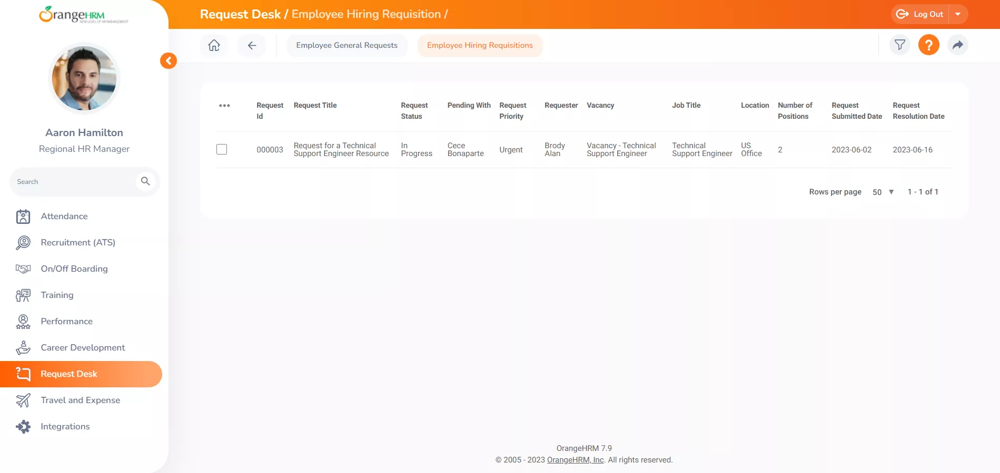

<!-- generated -->

# OrangeHRM

1-Click installation template for OrangeHRM on Easypanel

## Description

OrangeHRM is a comprehensive, open-source Human Resource Management (HRM) solution designed to streamline HR processes and manage employee information. It provides modules for employee management, leave tracking, time management, recruitment, and performance reviews. With an intuitive interface and customizable features, OrangeHRM is a great choice for organizations of all sizes.

## Benefits

- Comprehensive HR Management: OrangeHRM offers a complete suite of tools to manage all aspects of human resources, from recruitment to performance evaluations.
- Open Source and Customizable: Enjoy the flexibility of an open-source solution that you can tailor to fit your organization’s unique requirements.
- Scalable Solution: Ideal for small businesses and enterprises alike, OrangeHRM grows with your organization.

## Features

- Employee Information Management: Maintain a centralized database of employee records with easy access and updating capabilities.
- Leave and Time Tracking: Streamline leave requests, approvals, and attendance tracking with automated tools.
- Recruitment and Onboarding: Manage job postings, applicant tracking, and onboarding processes with ease.
- Performance Reviews: Conduct structured performance evaluations and manage employee goals.

## Links

- [Website](https://www.orangehrm.com/)
- [Github](https://github.com/orangehrm/orangehrm)
- [Template Source](https://github.com/easypanel-io/templates/tree/main/templates/orangehrm)

## Options

Name | Description | Required | Default Value
-|-|-|-
App Service Name | - | yes | orangehrm
App Service Image | - | yes | orangehrm/orangehrm:5.7

## Screenshots

## Change Log

- 2025-01-23 – Template Release

## Contributors

- [Ahson Shaikh](https://github.com/Ahson-Shaikh)
