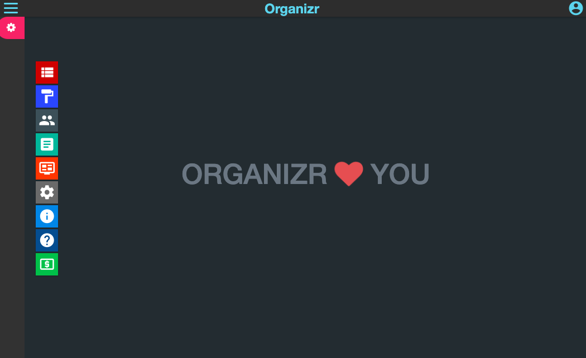

<!-- generated -->

# Organizer

1-Click installation template for Organizer on Easypanel

## Description

Organizer is a self-hosted service designed to help you manage and organize your various web applications efficiently. It serves as a centralized portal where you can categorize and access all your self-hosted apps in a simple and intuitive way. Written in PHP, Organizer provides a dashboard for quick navigation, supports authentication for security, and integrates with various third-party applications. It offers a customizable interface, supports mobile devices, and ensures a seamless experience for managing multiple services within your home or business environment.

## Benefits

- Centralized App Management: Organizer acts as a single portal to access and manage all your self-hosted applications. This helps streamline navigation and enhances productivity.
- Secure Authentication: Supports user authentication to restrict access and ensure only authorized users can manage and access applications.
- Customizable Interface: Provides options to customize the look and feel, allowing users to tailor the dashboard according to their preferences.

## Features

- Dashboard View: Offers a simple and intuitive dashboard where users can quickly access various self-hosted applications.
- Multi-User Support: Supports multiple users with different permission levels, making it ideal for shared environments.
- API Integration: Integrates with external APIs for enhanced functionality, such as fetching data from other applications.
- Mobile-Friendly Design: Designed to work seamlessly on mobile devices, allowing users to manage their applications from anywhere.
- Authentication & Security: Provides authentication mechanisms, including OAuth and LDAP integration, to secure access to the portal.

## Links

- [Github](https://github.com/causefx/Organizr)
- [Template Source](https://github.com/easypanel-io/templates/tree/main/templates/organizer)

## Options

Name | Description | Required | Default Value
-|-|-|-
App Service Name | - | yes | organizer
App Service Image | - | yes | linuxserver/organizr:version-f6d984d2

## Screenshots

## Change Log

- 2025-01-30 – First release

## Contributors

- [Ahson Shaikh](https://github.com/Ahson-Shaikh)
