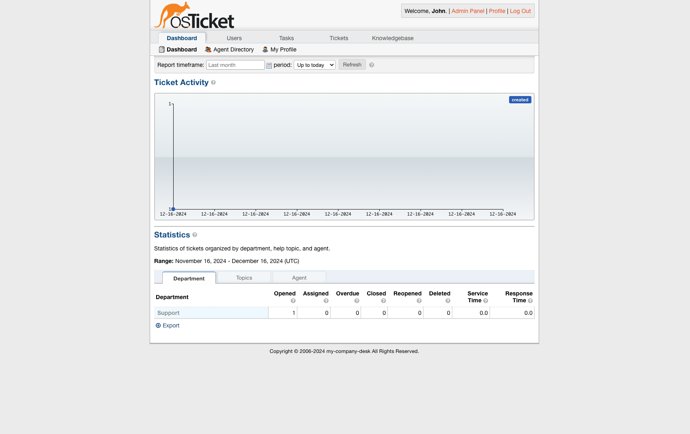

<!-- generated -->

# OSTicket

1-Click installation template for OSTicket on Easypanel

## Description

OSTicket is a widely-used, open-source ticketing system designed to streamline customer support management. It provides a user-friendly interface for handling, tracking, and organizing support tickets across multiple channels, including email, web forms, and API integrations. With OSTicket, you can efficiently manage inquiries, automate workflows, and improve customer satisfaction.

## Instructions

You can configure other Environmental settings in Environment Section.

## Benefits

- Streamlined Ticket Management: OSTicket simplifies the process of handling, organizing, and managing customer support tickets across multiple channels, improving response times and customer satisfaction.
- Self-Hosted Solution: Retain full control over your customer support system with a self-hosted solution, ensuring privacy and security for your organization.
- Workflow Automation: Automate common support processes like ticket routing, escalation, and responses to save time and boost team efficiency.

## Features

- Multi-Channel Ticket Support: Receive and manage tickets through email, web forms, and API integrations to centralize customer inquiries in one platform.
- Customizable Ticket Workflows: Define custom workflows, forms, and fields to meet your specific support needs.
- Reporting and Analytics: Gain valuable insights into your support team's performance with built-in reporting and analytics tools.
- SLA Management: Track and enforce Service Level Agreements (SLAs) to ensure tickets are resolved within committed timelines.
- Knowledge Base: Provide self-service options to customers by creating and managing a searchable knowledge base with FAQs and guides.

## Links

- [Documentation](https://docs.osticket.com)
- [Github](https://github.com/osTicket/osTicket)
- [Template Source](https://github.com/easypanel-io/templates/tree/main/templates/osticket)

## Options

Name | Description | Required | Default Value
-|-|-|-
App Service Name | - | yes | osticket
App Service Image | - | yes | tiredofit/osticket:3.6.2
SMTP Server Host | - | yes | smtp.example.com
SMTP Server Port | - | yes | 25
SMTP Server Username | - | no | 
SMTP Server Password | - | no | 
SMTP From Email | - | yes | no-reply@example.com
SMTP From Name | - | yes | example
SMTP From Name | Name for your company's desk. | yes | my-company-desk
Install Email | - | yes | no-reply@example.com
Admin First Name | - | yes | John
Admin Last Name | - | yes | Doe
Admin Email | - | yes | admin@example.com
Admin Username | Username must be at least 6 characters | yes | ostadmin
Admin Password | Password must be at least 6 characters | yes | 

## Screenshots

## Change Log

- 2024-12-16 – Template Release

## Contributors

- [Ahson Shaikh](https://github.com/Ahson-Shaikh)
