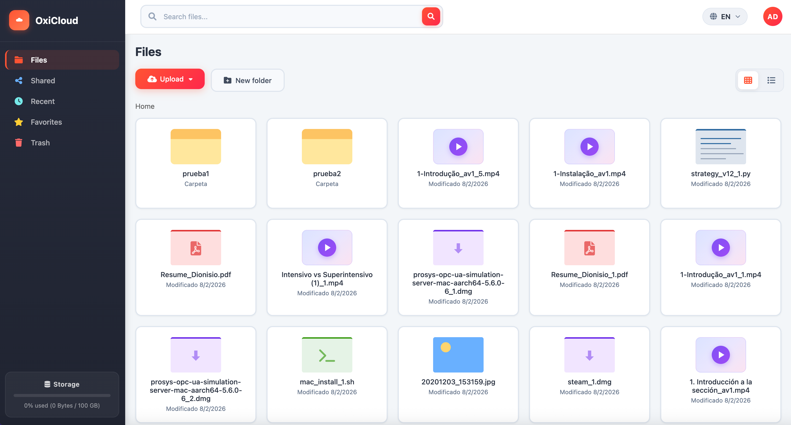

<!-- generated -->

# OxiCloud

1-Click installation template for OxiCloud on Easypanel

## Description

OxiCloud is an ultra-fast, secure, and lightweight self-hosted cloud storage written in Rust. It serves as a lightweight alternative to NextCloud, designed for low-resource environments. OxiCloud runs on just 512MB RAM with sub-second response times, offering file management, user authentication, file deduplication, search, CalDAV calendars, CardDAV contacts, and multi-language support. Built with Clean Architecture, it provides a clean UI that works on desktop and mobile.

## Instructions

Set OXICLOUD_BASE_URL on the app service to your public URL (e.g. https://cloud.example.com)
if you access OxiCloud via a domain; otherwise auth and share links can break. Database
migrations run automatically on first start. JWT signing uses a generated OXICLOUD_JWT_SECRET.

## Benefits

- Lightweight & Fast: Runs on 512MB RAM with sub-second responses. Built in Rust with LTO optimization—no PHP overhead or garbage collection.
- NextCloud Alternative: A simpler, faster alternative to NextCloud for home servers and low-resource hardware like Raspberry Pi.
- Complete Data Ownership: Self-hosted solution with full control over your files, calendars, and contacts. No third-party cloud dependency.

## Features

- File Storage: Upload, download, and organize files with folder management, drag-and-drop, trash bin, and file deduplication.
- CalDAV & CardDAV: Calendars and contacts with standard CalDAV/CardDAV support for sync with mobile and desktop clients.
- User Authentication: JWT-based authentication with personal folders per user, favorites, and recent files.
- Search & Multi-Language: Search across files and folders. Supports English, Spanish, and Persian out of the box.

## Links

- [Github](https://github.com/DioCrafts/OxiCloud)
- [Documentation](https://github.com/DioCrafts/OxiCloud/tree/main/doc)
- [Docker Hub](https://hub.docker.com/r/diocrafts/oxicloud)
- [Template Source](https://github.com/easypanel-io/templates/tree/main/templates/oxicloud)

## Options

Name | Description | Required | Default Value
-|-|-|-
App Service Name | - | yes | oxicloud
OxiCloud Image | - | yes | diocrafts/oxicloud:0.5.1
PostgreSQL Image | - | yes | postgres:17.9-alpine3.23

## Screenshots

## Change Log

- 2026-02-16 – Template Release (v0.3.4)

## Contributors

- [Ahson Shaikh](https://github.com/Ahson-Shaikh)
