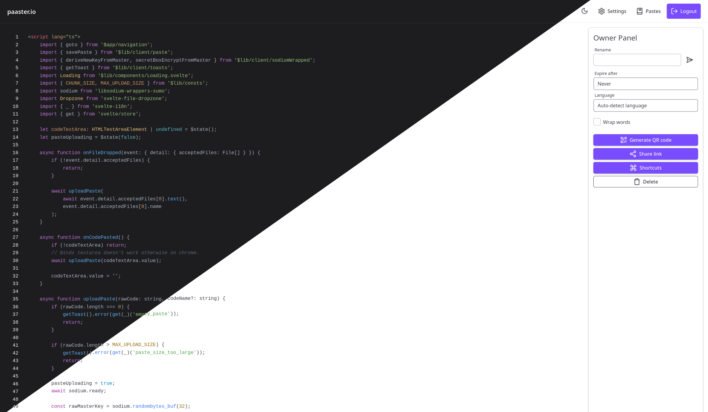

<!-- generated -->

# Paaster

1-Click installation template for Paaster on Easypanel

## Description

Paaster is a secure and user-friendly pastebin application with end-to-end encryption. Content is encrypted locally in your browser—the key never reaches the server. Features paste history, delete-after-view, file drag &amp; drop, and API. Supports MinIO, S3, R2, and other S3-compatible storage.

## Instructions

After deployment, access Paaster via the main domain. Pastes are E2EE by
default. Uses built-in MinIO for storage. If using MinIO, create the bucket
&quot;paaster&quot; in the MinIO console (minio-$(domain):9001) or via mc CLI:
mc mb minio_instance/paaster; mc anonymous set none minio_instance/paaster.
For external S3/R2, set S3 env vars on the Paaster service.

## Benefits

- End-to-End Encryption: Content encrypted in browser, key never sent to server
- Privacy-First: Your pastes stay confidential and under your control
- Paste History: Unix-like search across your paste history
- Flexible Storage: MinIO, S3, R2, or other S3-compatible backends

## Features

- Delete After View: Auto-delete pastes after views or expiration
- File Drag & Drop: Easy file upload support
- API & CLI: REST API and pip CLI for terminal uploads
- QR Code Sharing: Share pastes via QR codes

## Links

- [GitHub](https://github.com/WardPearce/paaster)
- [Website](https://paaster.com)
- [Documentation](https://github.com/WardPearce/paaster/blob/main/README.md)
- [Template Source](https://github.com/easypanel-io/templates/tree/main/templates/paaster)

## Options

Name | Description | Required | Default Value
-|-|-|-
App Service Name | - | yes | paaster
App Service Image | - | yes | wardpearce/paaster:3.1.7
MongoDB Image | - | yes | mongo:8.2.6
MinIO Image | - | yes | quay.io/minio/minio:RELEASE.2025-09-07T16-13-09Z

## Screenshots

## Change Log

- 2026-03-09 – First Release

## Contributors

- [Ahson Shaikh](https://github.com/Ahson-Shaikh)
