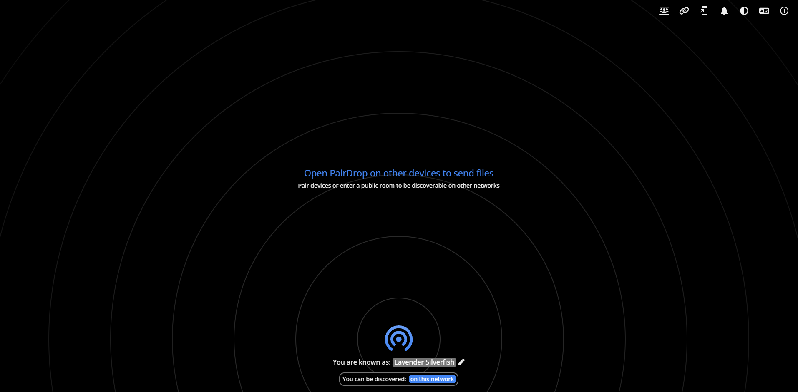

<!-- generated -->

# PairDrop

1-Click installation template for PairDrop on Easypanel

## Description

PairDrop is an open-source peer-to-peer file sharing application designed for seamless and secure data transfer between devices on the same network. With its minimalist design and cross-platform compatibility, PairDrop ensures a user-friendly and efficient file sharing experience. It eliminates the need for third-party cloud services, offering a direct and private solution for sharing files, links, and other data securely.

## Benefits

- Peer-to-Peer File Sharing: PairDrop provides direct peer-to-peer file sharing, ensuring that your data is not stored on third-party servers, keeping transfers private and secure.
- Cross-Platform Compatibility: PairDrop supports various platforms, including Windows, macOS, Linux, Android, and iOS, making it accessible for all devices on the same network.
- Easy to Use: With its simple and intuitive interface, PairDrop enables users to share files quickly and effortlessly, without requiring complex configurations.
- Open-Source and Free: PairDrop is an open-source solution, allowing users to enjoy its features without subscription fees or hidden costs.

## Features

- Local Network File Sharing: PairDrop operates on local networks, enabling secure and fast file transfers without the need for an internet connection.
- Device Discovery: Automatically discover and connect to nearby devices for quick file sharing.
- End-to-End Encryption: Ensure that your files are transferred securely with built-in end-to-end encryption, protecting your data from unauthorized access.
- Lightweight and Minimalist: Designed to be lightweight, PairDrop runs efficiently on all devices, consuming minimal resources while providing robust functionality.

## Links

- [Website](https://pairdrop.net)
- [Documentation](https://pairdrop.net/docs)
- [Github](https://github.com/schlagmichdoch/pairdrop)
- [Template Source](https://github.com/easypanel-io/templates/tree/main/templates/pairdrop)

## Options

Name | Description | Required | Default Value
-|-|-|-
App Service Name | - | yes | pairdrop
App Service Image | - | yes | lscr.io/linuxserver/pairdrop:1.10.10

## Screenshots

## Change Log

- 2024-11-17 – Template Release

## Contributors

- [Ahson Shaikh](https://github.com/Ahson-Shaikh)
