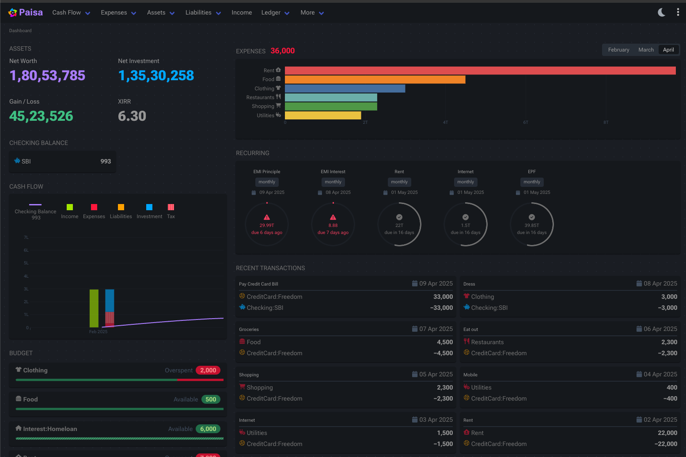

<!-- generated -->

# Paisa

1-Click installation template for Paisa on Easypanel

## Description

Paisa is a personal finance manager and expense tracker that helps you manage your finances, track expenses, and visualize your financial data.

## Benefits

- Expense Tracking: Track and categorize your expenses easily
- Financial Visualization: Visualize your financial data with charts and graphs
- Budget Management: Create and manage budgets for different categories
- Self-Hosted: Keep your financial data private on your own server
- Open Source: Free and open-source personal finance manager

## Features

- Expense Tracking: Record and categorize all your expenses
- Income Management: Track your income sources and payments
- Budget Planning: Create monthly or yearly budgets
- Financial Reports: Generate financial reports and insights
- Data Visualization: View your financial data in visual charts

## Links

- [Website](https://paisa.fyi)
- [GitHub](https://github.com/ananthakumaran/paisa)
- [Documentation](https://paisa.fyi/reference/accounts/)
- [Template Source](https://github.com/easypanel-io/templates/tree/main/templates/paisa)

## Options

Name | Description | Required | Default Value
-|-|-|-
App Service Name | - | yes | paisa
App Service Image | - | yes | ananthakumaran/paisa:v0.7.4

## Screenshots

## Change Log

- 2025-04-14 – First Release
- 2026-02-23 – Version bumped to v0.7.4

## Contributors

- [Ahson Shaikh](https://github.com/Ahson-Shaikh)
