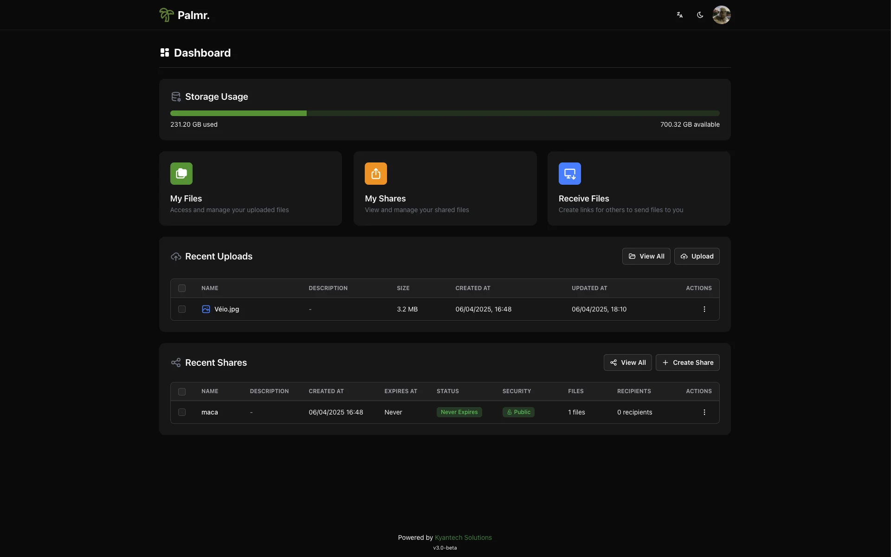

<!-- generated -->

# Palmr

1-Click installation template for Palmr on Easypanel

## Description

Palmr is a self-hosted file management and download application that provides a comprehensive solution for managing files and downloads. It features a modern web interface for file operations, download management, and file organization. Palmr supports various file operations including uploading, downloading, organizing, and managing your files in a centralized location.

## Benefits

- File Management: Centralized file management with uploading, downloading, and organizing capabilities for your file collection.
- Self-Hosted Control: Keep your files completely private and secure on your own server with full control over your file library.
- Download Management: Advanced download management with concurrent downloads, queue management, and memory optimization for large files.

## Features

- File Operations: Comprehensive file operations including upload, download, organize, and manage files with a modern web interface.
- Download Management: Advanced download system with concurrent downloads, queue management, and automatic memory scaling for optimal performance.
- Memory Optimization: Intelligent memory management with auto-scaling capabilities and garbage collection for large file downloads.
- S3 Compatible Storage: Optional S3-compatible storage integration for scalable file storage and cloud integration capabilities.
- File Encryption: Optional filesystem encryption for secure file storage with configurable encryption keys.
- Multi-Language Support: Multi-language interface support with configurable default language settings.
- Presigned URLs: Secure file sharing with presigned URLs and configurable expiration times for temporary access.
- Data Persistence: Reliable data storage for files, user preferences, and application state with persistent volume mounting.

## Links

- [Github](https://github.com/kyantech/palmr)
- [Documentation](https://palmr.kyantech.com.br/docs/2.0.0-beta)
- [Template Source](https://github.com/easypanel-io/templates/tree/main/templates/palmr)

## Options

Name | Description | Required | Default Value
-|-|-|-
App Service Name | - | yes | palmr
App Service Image | - | yes | kyantech/palmr:v3.1.1-rc.1

## Screenshots

## Change Log

- 2025-09-18 – Template Release

## Contributors

- [Ahson Shaikh](https://github.com/Ahson-Shaikh)
