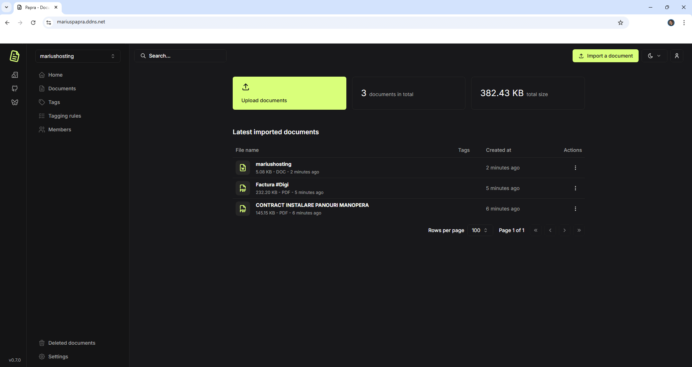

<!-- generated -->

# Papra

1-Click installation template for Papra on Easypanel

## Description

Papra is a modern, open-source project management and collaboration platform designed to help teams organize their work, track progress, and collaborate effectively. It provides a comprehensive suite of tools for task management, team communication, file sharing, and project tracking in a single, integrated platform. Papra offers an intuitive interface with powerful features for managing complex projects and workflows.

## Benefits

- Comprehensive Project Management: All-in-one platform for project management with task tracking, team collaboration, and progress monitoring in a single, integrated solution.
- Team Collaboration: Advanced collaboration features with real-time communication, file sharing, and team coordination tools for effective teamwork.
- Intuitive Interface: User-friendly interface designed for productivity with clean layouts, intuitive navigation, and customizable dashboards.
- Self-Hosted Solution: Complete control over your data with a self-hosted solution that keeps your projects and team information private and secure.

## Features

- Task Management: Powerful task management system with priority settings, due dates, assignments, and progress tracking for organized project execution.
- Team Communication: Built-in communication tools with messaging, comments, and notifications to keep your team connected and informed.
- File Sharing: Secure file sharing and document management with version control and collaborative editing capabilities.
- Project Tracking: Comprehensive project tracking with timelines, milestones, and progress reports for better project visibility and control.
- Customizable Workflows: Flexible workflow customization to match your team's processes and project requirements.
- Mobile Access: Mobile-responsive design with native app support for accessing your projects and tasks from anywhere.

## Links

- [GitHub](https://github.com/papra-hq/papra)
- [Documentation](https://docs.papra.app)
- [Website](https://papra.app)
- [Template Source](https://github.com/easypanel-io/templates/tree/main/templates/papra)

## Options

Name | Description | Required | Default Value
-|-|-|-
App Service Name | - | yes | papra
App Service Image | Papra Docker image | yes | ghcr.io/papra-hq/papra:0.9.1-rootless

## Screenshots

## Change Log

- 2025-09-11 – Initial Template Release (0.9.1-rootless)

## Contributors

- [Ahson Shaikh](https://github.com/Ahson-Shaikh)
