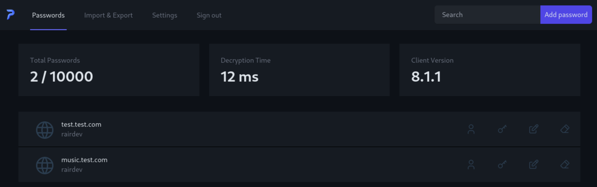

<!-- generated -->

# Passky Server

1-Click installation template for Passky Server on Easypanel

## Description

Passky is a simple, modern, lightweight, open source and secure password manager. It allows you to securely store and manage your passwords, ensuring your sensitive credentials remain protected. This self-hosted server component works with the Passky clients (web, desktop, and mobile apps) to provide a complete password management solution that puts you in control of your data.

## Benefits

- Complete Privacy Control: Self-host your password manager to maintain full control over your sensitive credentials without relying on third-party services.
- Open Source Security: Passky's open-source nature means the code can be audited by security professionals, ensuring there are no hidden vulnerabilities or backdoors.
- Scalable Architecture: Configure your server with SQLite for simplicity or scale up with MySQL and Redis for improved performance and concurrent connections.

## Features

- Secure Password Storage: Store passwords with strong encryption to keep your sensitive data protected from unauthorized access.
- Two-Factor Authentication: Enhance security with optional two-factor authentication including YubiKey support for hardware-based security.
- Multiple Database Options: Choose between SQLite for simplicity or MySQL for better performance and scalability depending on your needs.
- Rate Limiting Protection: Built-in rate limiting protects your server from brute force attacks and ensures stable performance under load.
- Cross-Platform Compatibility: Works with all Passky clients including web, desktop (Windows, macOS, Linux), and mobile (Android, iOS) applications.

## Links

- [Website](https://passky.org)
- [GitHub](https://github.com/Rabbit-Company/Passky-Server)
- [Docker Hub](https://hub.docker.com/r/rabbitcompany/passky-server)
- [Template Source](https://github.com/easypanel-io/templates/tree/main/templates/passky)

## Options

Name | Description | Required | Default Value
-|-|-|-
App Service Name | - | yes | passky-server
App Service Image | - | yes | rabbitcompany/passky-server:8.1.8
Admin Username | - | yes | admin
Admin Password | - | yes | admin

## Screenshots

## Change Log

- 2025-04-22 – first release

## Contributors

- [Ahson Shaikh](https://github.com/Ahson-Shaikh)
