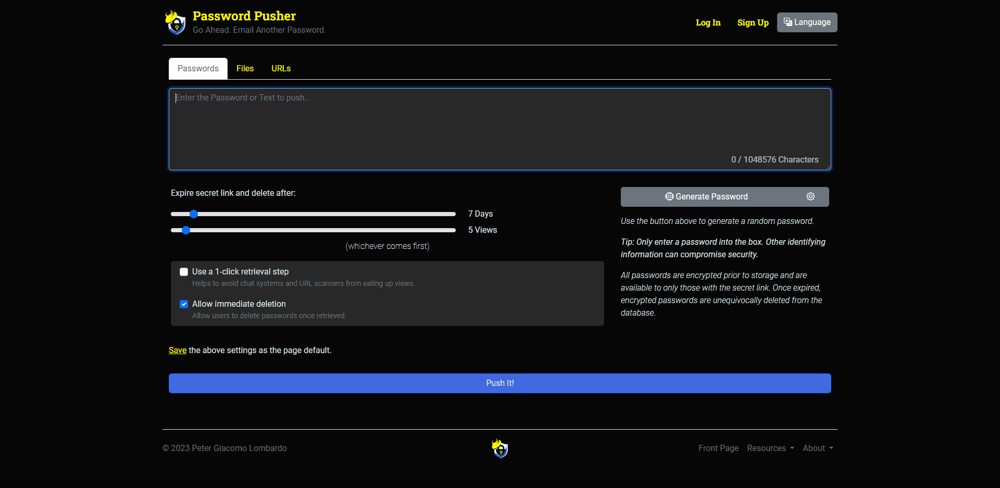

<!-- generated -->

# Password Pusher

1-Click installation template for Password Pusher on Easypanel

## Description

Password Pusher is an open-source, self-hosted application designed to securely share passwords and sensitive information via unique, time-sensitive URLs. It eliminates the need to send sensitive credentials through insecure channels like email or messaging apps. The app is lightweight, easy to deploy, and prioritizes user privacy and security. Password Pusher allows for fine-grained control over link expiration, including the number of views or days before a link expires. It ensures that shared passwords are destroyed after expiration, adding an extra layer of security. The app can be deployed on various platforms such as Docker or Kubernetes, making it highly flexible and accessible for individuals and organizations alike.

## Benefits

- Secure Password Sharing: Password Pusher ensures secure password sharing through self-destructing URLs. This eliminates the need to send passwords via insecure channels like email or chat, protecting sensitive credentials.
- Time-Sensitive Links: Links generated by Password Pusher can be set to expire after a specific number of views or days. This ensures that shared credentials are automatically destroyed after their intended use, enhancing security.
- Easy Deployment: Password Pusher is lightweight and easy to deploy on various platforms like Docker and Kubernetes. This makes it highly accessible for individuals and organizations to set up and use.

## Features

- Customizable Expiration Controls: Password Pusher provides fine-grained control over link expiration. You can specify the number of views or days after which the shared link will be destroyed, ensuring sensitive data is not accessible indefinitely.
- Self-Hosted Privacy: Password Pusher is self-hosted, ensuring that you have complete control over your data. This means that no third party has access to your shared credentials.
- Lightweight and Fast: The app is designed to be lightweight and fast, with minimal resource usage. It is easy to deploy and maintain, making it ideal for small teams or large organizations.
- Flexible Integration: Password Pusher supports integration into existing workflows through its API. This allows you to automate the process of password sharing and management.

## Links

- [Website](https://pwpush.com)
- [Documentation](https://github.com/pglombardo/PasswordPusher/wiki)
- [Github](https://github.com/pglombardo/PasswordPusher)
- [Template Source](https://github.com/easypanel-io/templates/tree/main/templates/passwordpusher)

## Options

Name | Description | Required | Default Value
-|-|-|-
App Service Name | - | yes | passwordpusher
App Service Image | - | yes | pglombardo/pwpush:1.50.6

## Screenshots

## Change Log

- 2025-01-27 – First Release

## Contributors

- [Ahson Shaikh](https://github.com/Ahson-Shaikh)
