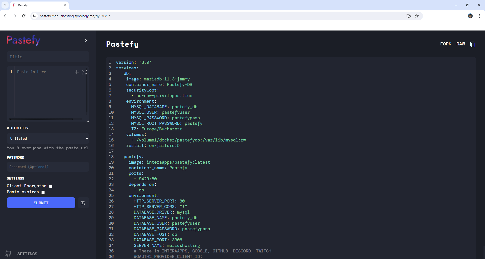

<!-- generated -->

# Pastefy

1-Click installation template for Pastefy on Easypanel

## Description

Pastefy is a feature-rich, open-source, self-hostable pastebin alternative to GitHub Gist or Pastebin. Share code snippets with friends or save them for yourself with syntax highlighting, file format previews, folder organization, OAuth2 authentication, API access, and powerful features for developers. Upload files via curl, integrate with VS Code, and enjoy extensive format support including Markdown, Mermaid, CSV, GeoJSON, and more.

## Benefits

- Feature-Rich Pastebin: Comprehensive alternative to GitHub Gist and Pastebin with advanced features like folder organization, OAuth2 authentication, API access, and extensive file format support.
- Developer-Friendly: Upload files via curl, integrate with VS Code and Raycast, access RESTful API with SDKs for JavaScript/TypeScript, Java, and Go. Perfect for development workflows.
- Extensive Format Support: Preview support for Markdown, Mermaid diagrams, SVG, CSV, GeoJSON, Diff files, calendar files, regex patterns, and Asciinema recordings with syntax highlighting.

## Features

- Rich Content Previews: Support for previewing various file formats including Markdown, Mermaid diagrams, SVG graphics, CSV data, GeoJSON maps, calendar files, and Asciinema terminal recordings.
- Authentication & Organization: OAuth2 login with multiple providers (InteraApps, Google, GitHub, Discord, Twitch), folder organization, paste management, and the ability to like and fork pastes.
- API & Integrations: Comprehensive REST API with official SDKs for JavaScript/TypeScript, Java, and Go. Extensions for VS Code and Raycast, plus command-line upload support via curl.
- Advanced Features: Copy buttons, raw preview mode, paste forking, custom CORS settings, encryption support, and configurable login requirements for reading and creating pastes.

## Links

- [Website](https://pastefy.app/)
- [Documentation](https://github.com/interaapps/pastefy/wiki)
- [Github](https://github.com/interaapps/pastefy)
- [Template Source](https://github.com/easypanel-io/templates/tree/main/templates/pastefy)

## Options

Name | Description | Required | Default Value
-|-|-|-
App Service Name | - | yes | pastefy
App Service Image | - | yes | interaapps/pastefy:7.1.5

## Screenshots

## Change Log

- 2025-06-12 – First Release
- 2025-12-29 – Version bumped to 7.1.5

## Contributors

- [Ahson Shaikh](https://github.com/Ahson-Shaikh)
