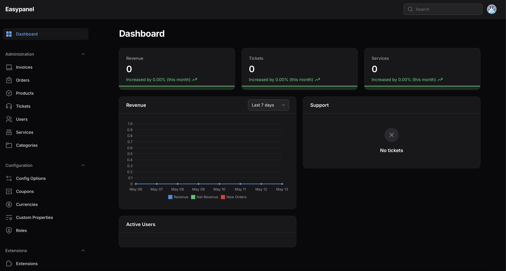

<!-- generated -->

# Paymenter

1-Click installation template for Paymenter on Easypanel

## Description

Paymenter is a modern, open-source billing and client management system. It provides a seamless platform for handling payments, subscriptions, and client services with support for multiple payment gateways and automated billing processes.

## Instructions

Connect the shell and run &quot;php artisan app:init&quot; to initialize the application, and paste your domain inside. Secondly, create an admin user on the same shell using &quot;php artisan app:user:create&quot;.

## Benefits

- Modern Billing System: A comprehensive solution for managing payments, subscriptions, and client services.
- Multiple Payment Gateways: Support for various payment providers to accommodate different business needs.
- Open Source: Fully open-source solution with active community support and regular updates.

## Features

- Automated Billing: Streamlined billing processes with automatic invoice generation and payment processing.
- Client Management: Complete client portal for managing services, invoices, and support tickets.
- Redis Integration: Uses Redis for efficient caching and session management.

## Links

- [Website](https://paymenter.org)
- [Documentation](https://paymenter.org/docs/getting-started/introduction)
- [Github](https://github.com/paymenter/paymenter)
- [Template Source](https://github.com/easypanel-io/templates/tree/main/templates/paymenter)

## Options

Name | Description | Required | Default Value
-|-|-|-
App Service Name | - | yes | paymenter
App Service Image | - | yes | ghcr.io/paymenter/paymenter:v1.1.0

## Screenshots

## Change Log

- 2025-05-13 – First Release

## Contributors

- [Ahson Shaikh](https://github.com/Ahson-Shaikh)
