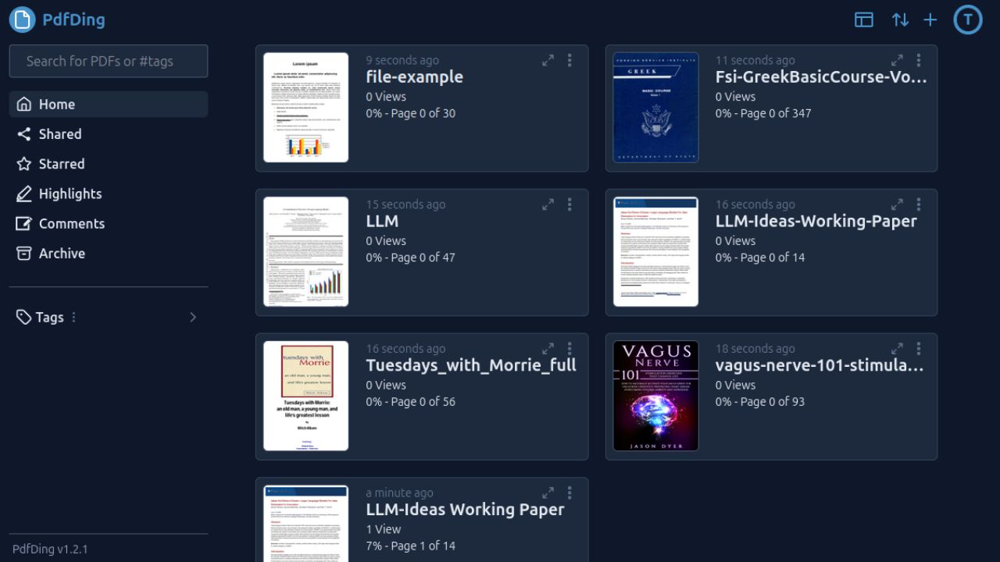

<!-- generated -->

# PdfDing

1-Click installation template for PdfDing on Easypanel

## Description

PdfDing is a self-hosted PDF management and processing application that provides a comprehensive solution for handling PDF documents. It offers features for viewing, organizing, and managing PDF files with a clean web interface. PdfDing supports various PDF operations including viewing, searching, and organizing your PDF collection in a centralized location.

## Benefits

- PDF Management: Centralized PDF document management with viewing, organizing, and searching capabilities for your PDF collection.
- Self-Hosted Control: Keep your PDF documents completely private and secure on your own server with full control over your document library.
- Clean Interface: Modern web interface with customizable themes and colors for a personalized document management experience.

## Features

- PDF Viewing: Built-in PDF viewer with support for various PDF formats and high-quality document rendering.
- Document Organization: Organize and categorize your PDF documents with folder structures and metadata management.
- Search Functionality: Search through your PDF collection with text-based search capabilities and metadata filtering.
- Theme Customization: Customizable themes and colors including dark and light modes with various color schemes.
- Secure Access: Secure document access with configurable cookie settings and CSRF protection for production deployments.
- Media Storage: Persistent storage for PDF documents and media files with reliable data persistence.
- SQLite Database: Lightweight SQLite database for storing document metadata, user preferences, and application state.

## Links

- [Github](https://github.com/mrmn2/PdfDing)
- [Template Source](https://github.com/easypanel-io/templates/tree/main/templates/pdfding)

## Options

Name | Description | Required | Default Value
-|-|-|-
App Service Name | - | yes | pdfding
App Service Image | - | yes | mrmn/pdfding:v1.3.1

## Screenshots

## Change Log

- 2025-09-18 – Template Release

## Contributors

- [Ahson Shaikh](https://github.com/Ahson-Shaikh)
